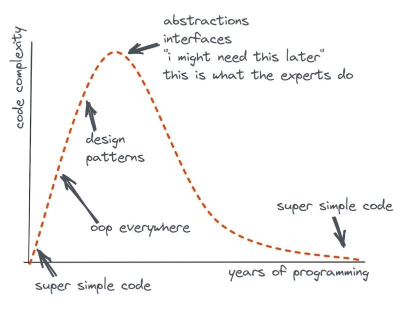

<i> 
    
Photo by <a href="https://unsplash.com/@hudsoncrafted?utm_content=creditCopyText&utm_medium=referral&utm_source=unsplash">Debby Hudson</a> on <a href="https://unsplash.com/photos/mason-jar-of-paintbrush-lot-MzSqFPLo8CE?utm_content=creditCopyText&utm_medium=referral&utm_source=unsplash">Unsplash</a>

</i>

Way back in one of my first software internships, I remember overhearing a conversation from another engineer. I don't remember much of the details honestly except that this one engineer was pretty frustrated with another about some recent code that was checked in. His last line was "Let's be consistent." as he walked back to his own cubicle.

As I mentioned, I don't know all the details of _what_ apparently needed to be consistent, but it stuck with me (clearly). I carried it through my first few professional years as an engineer. I wanted to write consistent, clear, crisp code. It felt like an unspoken rule that great codebases _were_ consistent; no exceptions.

As I've grown in my career, I've now come to realize that while consistency is a good goal in our software development, it isn't _the_ goal.

## Consistency Isn't the Goal

Before going on, let's first emphasize consistency is _good_. Being consistent in creating and practicing daily habits that lead to health, knowledge, etc. are [great tools for our growth](https://dangoslen.me/blog/identity-goals-systems/). Being consistent treating others with respect and kindness is important too.

But in our software development, it's not nearly as important. There are benefits, of course, in some areas of our systems. Things like:

* Consistent auth across services
* Consistent style guides across public interfaces and APIs (including things like event definitions)
* Consistent (enough) logging 
* Consistent languages across your tech stack 

You could take it further for things like naming or other styles, but most of the value is really found across public interfaces or message structures. Internal libraries that expose public APIs should also try to have consistent structures and styles. 

Beyond that, I've found that pushing for too much consistency starts to actually harm a codebase.

What happens is that an engineer might write a function or snippet of code to solve a problem. They get it working and commit it to main.

Another engineer sees and, without really understanding it, adopts it into their own code. Another engineer follows and notices the "pattern" of this code being used. They in turn follow suite. Then another and another. 

Instead of having a codebase in which engineers have spent some time applying critical thinking to their problem, they've adopted what I call pattern hunting.

## Pattern Hunting

I've written about patterns previously, and have tilted my hand that while patterns are useful [we tend to overuse](https://dangoslen.me/blog/our-obsession-with-patterns/) them in many contexts. 

One of the core reasons why we overuse them is we've stopped using them to solve problems we encounter. Instead, we go looking for places to implement a pattern we've learned about or seen elsewhere. While it might sound similar, it's dramatically different. In the former, you have a problem to solve and research the right solutions or patterns to use to help solve it. 

In the later, you have a shiny new pattern (or new technology) that you want to use no matter what. In this case, you'll use a complex pattern to abstract what could have been a simple `if` statement or function variable. 

This graph below shows a common (and somewhat caricatured) view of how engineers often progress through their coding patterns in their career.

<i>

Credit to [Rob Kerr's](https://www.linkedin.com/pulse/complexity-unlearning-curve-rob-kerr/) post with this chart.

</i>

Many engineers will quickly point out that abstractions and interfaces are important and critical parts of writing good software. And they are right! 

The difference in the chart is the between those engineers that understand them wield them as a tool vs. others who are trying to "do what experts do." The later - "consistency for consistencies sake" - leads to one thing: a mess.

## Too Much Consistency Hampers Innovation

On top of creating a problem of looking for solutions to problems, consistency can also stifle innovation and keeps the code from evolving overtime. 

Take for example an application struggling to keep up with load. An engineer notices that almost all of the application uses a connection factory that creates a new connection on every database query. This engineer decides to implement a connection pool to see if it would help. 

Being a data-driven engineer, they decide to measure their experiments and - tada! - the connection pool works! However, it required some rework for the queries in this part of the application. 

This engineer also is reasonably cautious and doesn't want to rework the entire application's code immedatily to use the connection pool. Instead of refactoring all the code at once, they push their change for _only_ a few pieces of the application first to make sure it _does_ work in production before doing a large overhaul. Once they get the data, they start working through the rest of the application to use the pool.

In this example, there are two times the engineer might have gotten pushback on consistency.

The first is the problem itself. Should they have ignored the problem since it would create inconsistency to change the application (which is one of several others the team owns) across the team? It would seem shortsighted to avoid making a measure and careful performance improvement when needed simply to keep things consistent.

The second is the deployment strategy. Should this engineer have "cowboy coded" their refactor and pushed the entire application at once? It would be a bit risky, especially for something the team is still learning to use, measure, and understand.

If this sounds like it would never happen, I've experienced this scenario myself in moving from on LDAP connection library to another some years ago. A few applicatoins used a library that was stable, but not performant. Another library that utilized a better connection pool was avaialble that we wanted to try. If we would have been held to being consistent with the patterns and tools in other applicatoins, we would have never been able to attain the performance benefits of switching.

## What to Focus on Instead

Instead of writing a consistent codebase that never veers from a known pattern, you should instead focus on the tried and true principles of building software:

* simple code first
* optimize for readabilty and maintainability through code reviews and tests
* optimize performance via metrics and experiments
* iterative refactoring

It's hard to go wrong with those principles.

Happy coding!

