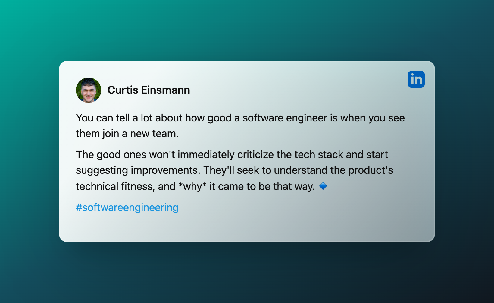

<i> 

Photo by <a href="https://unsplash.com/@hudsonhintze?utm_source=unsplash&utm_medium=referral&utm_content=creditCopyText">Hudson Hintze</a> on <a href="https://unsplash.com/photos/vpxeE7s-my4?utm_source=unsplash&utm_medium=referral&utm_content=creditCopyText">Unsplash</a>
  
</i>

You might have heard the expression, "Don't judge a book by its cover." It's an expression to keep people from making knee-jerk judgments about someone based on an initial impression or short interaction. People are complex, and we need to have multiple opportunities before making conclusions about the kind of person they are.

But we are also taught to make a good first impression when we meet people. Why? Because we also know that while we would hope people don't make conclusions about us from our first handshake, the truth is that our first interactions with others usually _do_ set the stage for how that relationship will be going forward. 

One place making the right impression is critical is when joining a new team. From sports to business, the teams we are a part of play a huge role in our lives. In business, especially, the teams you work with can significantly impact your career trajectory. 

This makes our first impressions when joining a new team even more critical. Whether we are transferring between teams at the same employer or moving to a brand new gig, the first few days are crucial. An excellent first impression in those first few days will make it easier to build trust and credibility with the team than if we come across as lazy, arrogant, incompetent, etc. 

After joining a brand new team a little over a year ago, I wanted to share some of the ways I was able to join the team, make a good first impression, and build high trust quickly. I've also written about some of these ideas in a [previous post](https://dangoslen.me/blog/the-best-ways-to-crush-it-as-a-new-team-member/), so I'll attempt to avoid repeating myself and bring fresh perspectives.

Let's dive in.

## Don't Be Critical Too Quickly

When joining a team, judging or criticizing them can be easy. From their technical decisions, stack of choice, or even process, there are many areas where you could find fault with the team. 

But this can be to your detriment. I really like how [Curtis Einsmann](https://www.linkedin.com/posts/curtiseinsmann_softwareengineering-activity-7018252549275156480-ZMbd?utm_source=share&utm_medium=member_desktop) talked about this on LinkedIn:

Be the good engineer Curtis describes: ask questions, read the docs, and seek to understand. Make suggestions for improvement rather than pronouncing critiques.

## Prefer Humility Over Ego

As an extension of the previous point, make sure you join your team with humility than ego. Even if you are the senior on the team or the tech lead, adopt a humble posture rather than bursting onto the scene with grand plans to fix everything (and never asking a question).

Humility has a bad rap in the software space. But this comes from a lack of understanding of humility. Many take humility to mean you think poorly of yourself or your skills. But that isn't humility; it's self-doubt. Humility has more to do with [thinking of your self less](https://www.goodreads.com/quotes/383930-humility-is-not-thinking-less-of-yourself-it-is-thinking); of thinking about your _importance_ less. 

When joining a technical team (and especially as a leader), having humility means you recognize that you always have something more to learn. It means realizing that the people on your team have the skills and capabilities _required_ to accomplish your team's mission - and those skills might be ones you lack. It's being open to new ideas rather than pushing for your own.

Starting with humility will allow you to [build trust](https://dangoslen.me/blog/lets-talk-about-trust/) among your new team. And trust is one of the key ingredients required for teams to work together to accomplish amazing things.

## Collaborate Early

The most significant thing I learned from joining my new team a year ago was that I should have collaborated more than I did. To be clear, I didn't isolate myself, but I wish it would have happened faster and more frequently. 

For many organizations, teams hope to get new engineers up and running quickly, with the metric being time to deploy their first code to production. You'll have an "onboarding buddy," a checklist to go through to set everything up and then usually have a work ticket to complete. 

Instead of just working on your own ticket, ask if you can pair on work your "buddy" is working on first. Or have them pair with you on your ticket. You'll understand the codebase better if you go through the code with someone who understands the nuances and history of how it got that way than just poking at it yourself.

Another way to collaborate is simply learning how _others_ within the org. work and collaborate. Do your best to attend as many meetings as you can to hear about what is happening in the organization. Join post-mortems, architectural reviews, decisions about projects you know nothing about, etc. The goal isn't to contribute to the meetings but to learn and observe the patterns of collaboration within the organization. What is the culture really like (not just the slide deck you got on day 1)? How do meetings tend to start and finish? Who seems to have the most credibility and respect? 

Getting answers to these questions will help you navigate the coming months and learn how to collaborate effectively.

## Focus on Building Relationships

Last, focus on building relationships in your first few weeks (and months!). Building relationships is the number one thing I wish I had focused on more when I joined my team last year. 

You might be worried that you should be focused on delivering value in your role, eager to prove you belong. And while that _is_ important, it can often take new hires [around six months](https://www.investopedia.com/financial-edge/0711/the-cost-of-hiring-a-new-employee.aspx) to fully get up to speed and start delivering value. 

Use this to your advantage. Now is the _best_ time to learn about your new colleagues both within your team and across the organization. Use this time to build your internal network. Set up a few one-on-one meetings with your teammates or ask your manager to introduce you to other engineers on different teams at the same level. See if you can set aside some time to learn from your director about what they think is really important for your team in the next year.

Building these relationships won't necessarily be immediately valuable, which might lead you to wonder if it's the best use of your time. It's important to remember here that these relationships will be useful later on. It's much easier to work on a complex cross-team project when you have a rapport with some of the other engineers involved ahead of time.

You'll also be surprised how much more information you become privy to when you have built relationships across the whole org. Whether you work in a physical office or not, the conversations in the proverbial "break room" are where information often travels thethe fastest. Leverage that as a tool to hear about what is happening on other teams or products. Take a bit of caution here to be sure (the rumor mill spins quickly), but don't plug your ears either.

---

The key takeaway from this is that when joining a new team, make sure to bring your soft skills to the table. Focus on building relationships, collaborating, and learning rather than criticizing out of the gate. This focus will help you build trust, which in turn will help you and your team grow into an exceptional team. 

And when the time comes when you need an ally or a mentor, you'll have a handful of teammates willing to help.

Happy coding!

