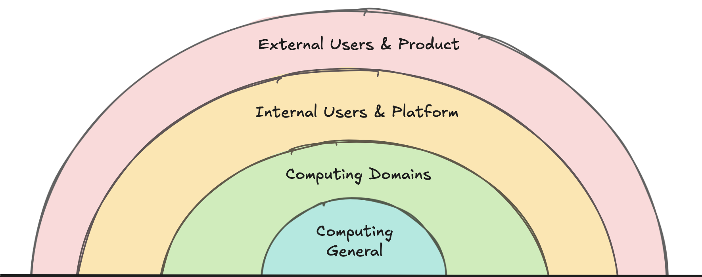

<i> 
    
Photo by <a href="https://unsplash.com/@cbpsc1?utm_content=creditCopyText&utm_medium=referral&utm_source=unsplash">Clint Patterson</a> on <a href="https://unsplash.com/photos/sliced-cake-on-blue-ceramic-plate-PPfAUR-jAis?utm_content=creditCopyText&utm_medium=referral&utm_source=unsplash">Unsplash</a>

</i>

Software companies love to talk about innovation. Whether they are building a product that will "revolutionize the way teams do X" or will "disrupt the market", there is real value in convincing investors your company is doing something unique and innovative.

You'll also see this idea on job postings or in advice on how to grow your career. To get to the next level, you must innovate, challenge the status quo, and bring new ideas to your teams. 

But we've also heard the tried-and-true adage, "Don't reinvent the wheel" or "Don't forget the basics." 

How can you reconcile these two ideas as you chart a course for growth in your career? 

In my experience, this comes down to learning that innovation is just like many software architectures: it's built in layers. 

## Layers of Innovation

What I mean by layers of innovation is that there are different "forms" of innovating in software. 

You could be building a new product that changes how teams communicate still utilize a (now conventional) cloud architecture. Or you could be rebuilding an existing application by moving it to the cloud to save on cost via Lambdas or other pay-as-you-go services.

You could also be working on an internal platform or foundations team, where you build technology to make the rest of your engineering group more effective. You innovate by finding the new, high-leverage abstractions that your specific team needs.

In each of these cases, being innovative means different things. You must consider your [audience](https://dangoslen.me/blog/know-your-audience/) or stakeholders for whom you are attempting to innovate. If you are trying to build an innovative product, you need to understand your customers. If you are building something to improve efficiency, you should have an in-depth understanding of who or what you are trying to make more efficient. 

With this context, being innovative isn't as tied to your capability to think about tough problems but more to your ability to re-think through the existing issues your audience faces and uncover novel solutions.

With this in mind, consider the different types of "levels" at which you could innovate. I tend to think of these groups in four large categories (with _lots_ of room for sub-categories within each):

* **Computing General**: This layer consists of things like core processing improvements, quantum computing, or building novel new data structures or algorithms. Innovations at this layer benefit the entire computing computing industry. Most of this is research from Ph. D.s through universities or corporations with internal research groups.
* **Computing Domains**: This layer includes new database technology, new or improved protocols for system interoperability, etc. Innovations at this layer tend to benefit mostly software companies, and that is why a lot of these improvements come through working groups made up of engineers across various organizations.
* **Internal User & Platform**: This layer focuses on building better tooling, improving the management of machines, or streamlining the deployment process for engineers. Innovations at this layer mostly benefit other software _engineers_ as they have better, cheaper, faster tools with which to build their products.
* **External User and Product**: This layer is where new SaaS companies, new desktop applications, or faster ways to purchase "X" come into play. Innovation at this level focuses on revenue-creating ideas via external users, attempting to get someone to use or purchase their software.

## Don't Forget the Basics

Okay, so we've talked about innovation and different ways to group or think about being an innovator.

How do you reconcile being an innovator (something that seems important to grow as an engineer) with "not reinventing the wheel?" (which also seems equally important)?

My perspective is that the idea of not reinventing the wheel has less to do with not building a new wheel and more to do with not forgetting the lessons and outcomes of prior innovation. It also depends on your goal: Are you trying to sell things that use wheels, or are you selling wheels themselves? 

Put another way, it depends on what layer you are working on.

For example, you probably don't want to invent your own secure hashing implementation at your company for hashing a password - unless you are a security researcher working at a user management company. It also probably doesn't make sense to build a new transport layer protocol - unless you happen to be at Google, where the difference between TCP and [QUIC](https://blog.cloudflare.com/the-road-to-quic/) is substantial latency and cost across your entire application space.

But even here, many innovations still build upon core computing fundamentals and simply look at them from a different angle. A favorite of mine is Apache Kafka. While there is much more to it than this, one of Kafka's core ideas was using a stream rather than a queue. It sounds subtle, but the impact is gigantic. By keeping an offset pointer to where a consumer is in a stream rather than simply reading from the front of a queue, Kafka can now enable multiple consumers to read the same message. 

Another is from the (likely now obsolete) [Haystack architecture](https://engineering.fb.com/2009/04/30/core-infra/needle-in-a-haystack-efficient-storage-of-billions-of-photos/) used at Facebook. One of the ways Haystack works is to store multiple photos into a single file. Yes, some management overhead comes into play here to read the right photo and quickly populate indexes. But at its core, these engineers understood that keeping a single file open vs. opening, reading, and closing multiple files has a performance improvement since they can easily seek to any position in the file if it's open. 

In both cases, these innovations (I'd place Kafka in the Computing Domain since it involved a new protocol and Haystack in the Internal User and Platform since it was mainly for performance improvements internally to Facebook) were based on understanding "the basics" of how computers worked and bringing a new question to existing paradigms: What if we had one large file instead of many? What if we didn't delete a message in the queue once it was read? 

Asking these kinds of questions framed around computing fundamentals can lead to incredible innovation.

## Standing on the Shoulder of (not-so-standard) Standards

With all this in mind, I'd like to share my own recent experience with innovating at the Internal User and Platform layer.

At Vouch, we use the [Inbox Pattern](https://en.wikipedia.org/wiki/Inbox_and_outbox_pattern) extensively. We've built our own abstractions and tools to make it easy for any new application to use the Inbox Pattern with a few lines of code. 

But one of the gaps we had was searching for a message in an Inbox. We didn't have an easy way to search for messages unless we opened up a connection to the datastore an app was using. While not a terrible experience for one application, it was difficult if you wanted to search across several quickly. We really wanted a REST endpoint to query and find records through.

Thankfully NestJS makes building an auto-mounted controller (via a Module) was pretty straightforward. Not a lot of innovation there.

But where things got interesting was filtering or searching. Messages often have different shapes and fields, so building a reusable filter param set would be difficult. Thankfully, we realized we were storing our messages in JSON—and that meant we could use [JSON Paths](https://en.wikipedia.org/wiki/JSONPath)! I won't cover the details of JSON Paths; just know that JSON Paths are a "standard" (yet not so standard once you get into the details) way of extracting and filtering JSON data.

We also realized that we had built an abstract class that represented our datastore for records, and that meant we could build into our datastore the ability to apply a JSON Path supplied to the controller without applications having to do that work themselves. Since most of our applications use the same database, we could give this capability to _every_ app for free! All that apps needed to do was init the abstract datastore class and pass it via NestJS dependency injection to the auto-mounted controller.

If you are thinking, " Yes, this is pretty basic stuff...", you are absolutely right! We didn't build anything "new" here: dependency injection has been around for a while, JSON Paths have been around, too, and SQL is as battle-tested as anything out there. How is this innovating?

In my humble view, this was innovative because it enabled our internal teams to search for arbitrary messages using mostly standard syntax in a query parameter without jumping across database connections or remembering SQL syntax. We improved the user experience for engineers through existing tools and methods, which allowed us to deliver the functionality quickly. Engineers only needed to remember some basic JSON Path expressions (which our team uses considerably in other contexts, so it's not a stretch here). 

Innovation didn't come from building something shiny and new but from standing on the shoulders of (not-so-standard) standards. We looked at the problems of our audience (other engineers) and asked a simple question: What if you could search using a JSON filter?

Now, teams have faster tools in their toolbelt for building and debugging our software.

---

The quick summary here is that innovating as an engineer doesn't require profound technical skills. Instead, it requires paying close attention to the problems your users face and asking the seemingly silly questions that no one has thought to ask before. It's about being perceptive more than about being "smart."

To be fair, you likely _will_ encounter a problem that requires gaining new skills to solve and innovate. That is great! Go get the skills you need to solve it when you find it.

But I also bet you'll encounter many problems that use software fundamentals in a slightly novel way than you might have thought. So don't throw them out—get really good at them.

Happy coding!
