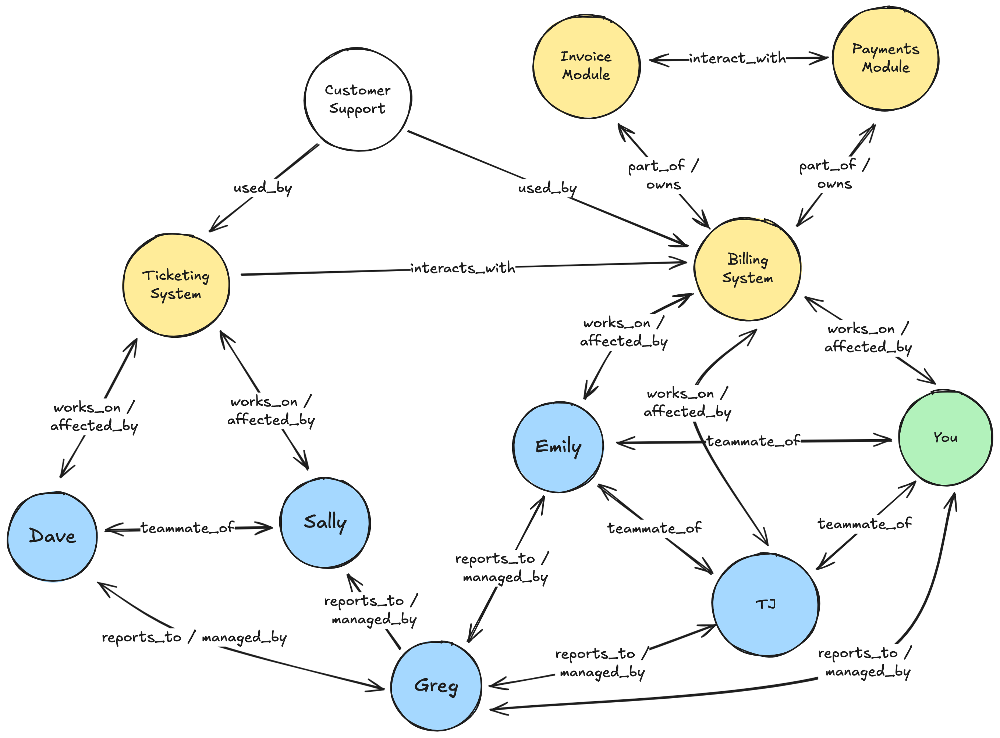

<i> 
    
Photo by <a href="https://unsplash.com/@clintadair?utm_content=creditCopyText&utm_medium=referral&utm_source=unsplash">Clint Adair</a> on <a href="https://unsplash.com/photos/green-and-black-rope-BW0vK-FA3eg?utm_content=creditCopyText&utm_medium=referral&utm_source=unsplash">Unsplash</a>

</i>

If you've ever joined a new team, tackled a legacy codebase, or stepped into an unfamiliar domain, the feeling can be overwhelming. 

There's too much to know—and not enough time to learn it all. 

That's why I use a model I call **traversing the knowledge graph**. It helps me orient quickly, pull in the most relevant context, and start contributing with confidence.

In this post, I'll describe:

1. How I think and model my internal knowledge graph
2. Why the concept of strongly connected components can help you learn faster
3. How I use my knowledge graph to help me [ask better questions](/blog/the-best-ways-to-crush-it-as-a-new-team-member/) and expand my knowledge

---

## The Knowledge Graph & Learning Clusters

When joining a new organization, team, or being asked to work on a project in a different area, you need to learn the domain quickly to be effective.

Instead of trying to read every line of code or read every document ever written [^1] to gain historic context, the best place to start is to first orient yourself on a few core pieces of information.

1. **The Team**: Who are you working with? And who do _they_ work with? How do they work?
2. **The Domain**: What are you working on? What other domains interact with or affect that domain? Who are your users?
3. **The Technology**: What kind of software are you working on? What tools, processes, or guidelines exist for that technology?

The best way I've learned to understand how this all works together is by building a mental model of those relationships. And the easiest way I've found to visualize that model is via a [labeled directed graph](https://en.wikipedia.org/wiki/Directed_graph). 

Here is an example of a made up group of engineers with a single manager and two sub-systems of a larger software platform (I'm omitting the technology part here for brevity as it could easily become really entangled, but relationships like "runs_on Express" or "deployed_by ArgoCd" could all be links in the graph):

 

A simplified (and fictional) version of how I think about my knowledge graph: I represent people, systems, sub-systems, and technology as vertices with many labeled edges to connect them.

## Find the Strongly Connected Components

In graph theory, there's a construct called a [strongly connected component](https://en.wikipedia.org/wiki/Strongly_connected_component) (SCC): a group of nodes where every node is reachable from every other node, following the edge directions. These SCCs are powerful because they represent dense regions of mutual context.

I use the idea of SCCs to help identify the core part of what we talked about earlier: the Team, the Domain, and the Technology.

However, in the real world, it is rare that SCCs are truly partitioned like a formal SCC would be. So instead of holding fast to the formal definition of strong connected components, on something a bit more flexible: what I call **domain clusters**.

These are groups of people and systems that are **tightly interrelated**—maybe not perfectly connected in the formal graph theory sense—but close enough that learning one helps you understand the rest [^2].

These learning clusters might look something like this (each cluster as an overlay on the previous graph).

 

Adding "domain cluster" overlays showing where there are strong connections between vertices. These are often teams, similar technologies, related services, working groups, etc. You will be part of many of these clusters within your organization.

As you can see, this view helps to: 

* Anchor where you are and what you are expected to be doing in your new domain
* Zoom out to see the relationships beyond your immediate domain
* Show you how to traverse across these domains

Collectively, this can serve as a good map for whom to talk to about what and why. And that is often the fastest way to learning a new team or domain: the right question to ask the right person.

## Asking Better Questions

When learning a new domain or joining a new team, asking questions is essential. It might be tempting to avoid asking questions for fear of looking like an imposter, but that won't help you learn as quickly as you need.

While the example above is small and trivial, you might realize that Customer Support uses the Billing System to handle support tickets through the Ticketing System. Interestingly enough, the graph doesn't contain any information about _who_ works in customer support, nor about common problems. These are gaps in your graph that you can ask about to learn more.

Additionally, you'll notice Greg is the overlap between the Ticketing and the Billing System. This can help you learn more about what work is slated for that team and how it might affect your team. 

In both cases, the graph is helping you either see how to traverse to find information about adjacent domains to yours, while also exposing gaps. Both are great places to ask questions.

There is a fine line to walk here, though. If you ask too many questions or repeat the same questions over and over, you'll likely annoy or frustrate the very people you are asking. As such, be diligent and write down the answers to the questions you ask via a worklog or [engineering day book](https://hackernoon.com/you-should-be-using-a-software-engineering-daybook).

These techniques surface connections and hidden dependencies, making your knowledge graph more complete and your learning clusters easier to spot.

## Final Thoughts

As always, your mileage may vary with these techniques. 

I do, however, recommend you _try_ them before making a final judgement. I've been able to switch into several teams and domains over the past several years by building a mental model and applying these exact principles to it.

Another important bit is you won't leave those models behind when you shift again to something different. [Mental models are a force multiplier](https://jamesclear.com/mental-models) in your ability to understand software systems and the people that work on them. 

While the graph I gave earlier only shows a few edges, in reality my mental model includes relationships to describe the _behaviors_ of individuals I'd like like to learn, the _common patterns_ between software components worth mastering, and _first principles_ that seem to apply universally in how to solve problems.

Investing in your mental models (and thinking about them as such) will pay dividends over time as you learn new things and dive into new challenges.

Happy coding!

[^1]: To be fair, reading as much as you _reasonably_ can is always a good idea, but it is often impossible to read it _all_ and in many cases the documentation is either incomplete or out-of-date. Focus on reading context for your closest SCC/learning cluster.
[^2]: While a formal SCC requires full mutual reachability via directed edges, the clusters I refer to here don’t always meet that strict definition. For example, someone like Greg or the Billing System might appear in multiple overlapping clusters. That’s okay—in fact, it's helpful. These overlapping nodes are often your best leverage points for learning.