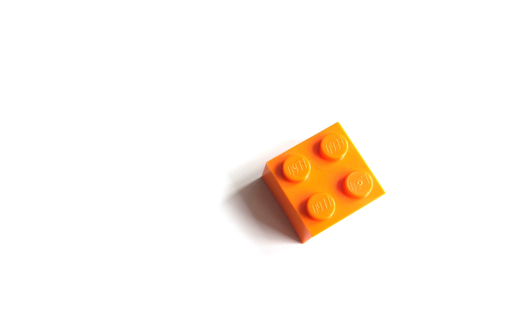

<i> 
    
Photo by <a href="https://unsplash.com/@helloimnik?utm_content=creditCopyText&utm_medium=referral&utm_source=unsplash">Nik</a> on <a href="https://unsplash.com/photos/qXakibuQiPU?utm_content=creditCopyText&utm_medium=referral&utm_source=unsplash">Unsplash</a>

</i>

Habits. We all have them. 

Some habits hold us back and keep us from achieving our goals. Examples include staying up too late, overeating, and looking at our phone whenever we have a moment of free time.

But other habits are incredible forces for our progress. As James Clear's _[Atomic Habits](https://www.goodreads.com/book/show/40121378-atomic-habits)_ discusses, we can build habits that make it easy to do the right thing every time. If we intentionally build habits, they can help us [reinforce our identity](https://dangoslen.me/blog/identity-goals-systems).

Habits, therefore, can be a great way to improve as an engineer (or in any profession).

Instead of trying to build a robust set of strong habits from the start (i.e., working out every day), a better approach is to start small. Look for habits small enough you can build quickly but that significantly impact your day-to-day. These "micro-habits" can compound in incredible ways towards your career growth.

Today, I'm sharing six micro-habits of great engineers that you can start practicing this week.

_This is a longer article, so here is a brief table of contents if you want to jump!_

* _[Make Small git Commits](#1-make-small-git-commits)_
* _[Find Time to Focus](#2-find-time-to-focus)_
* _[Take Breaks From Screens](#3-take-breaks-from-screens)_
* _[Create Space to Collaborate](#4-create-space-to-collaborate)_
* _[Pause Before Giving Feedback](#5-pause-before-giving-feedback)_
* _[Backup Opinions with Data](#6-backup-opinions-with-data)_

---

# 1 - Make small git Commits

As engineers, we spend a good chunk of our time coding. While we will do many other activities, becoming an efficient and productive coder is crucial to becoming a great engineer.

A good micro-habit to adopt that will help with your coding is to make small git commits. 

Whenever you complete a logical unit of code (complete with tests!), commit it.

Don't wait for all the changes you plan to make for a feature to be complete before committing.

Small commits avoid the awful situation where you've made multiple changes, but the code won't compile or tests won't pass. If you can't figure it out, you might have to undo a lot of work! Small commits let go back to the previously working commit with less loss.

Commits like this give you flexibility, too. You can open a pull request or merge your work at any point. If your code is always working, you are always in a place to merge it. For prep work or code refactors, this can help your whole team as they can benefit earlier from your improvements.

Small commits also tell a clear story of what you did and when. Your future self will be thankful for that when attempting to understand each commit and where a bug might have been introduced.

And if you are worried about too many commits, you can always perform a rebase right or squash them right before you merge your code.

# 2 - Find Time to Focus

At some point in your career, you will have a big problem to tackle that requires not just skill but focus. Engineers must prioritize time with minimal distractions to focus on our most important issues. 

Sadly, focus won't magically become a part of your day when you get promoted. It takes intentionality and practice. No professional weight-lifter lifted what they can today when they first started in the sport. They had to make time to lift and progressively lift heavier and heavier weights.

Start this week by finding 2-3 blocks on your calendar when you can turn off the notifications and practice focus work. Give the work in front of your full attention. If you do it regularly, you'll likely even start experiencing [Flow](https://dangoslen.me/blog/flow-and-developer-productivity/). 

When your mind starts to wander, take a short break, avoid mindless scrolling, and then get back to it. Techniques like [Pomodoro](https://en.wikipedia.org/wiki/Pomodoro_Technique) or using software to limit your screen time can also be helpful here. 

If you start working on prioritizing focus and putting it on your calendar, you'll accomplish more this week than you anticipated.

Speaking of screens...

# 3 - Take Breaks From Screens

We all know that staring at screens all day can drain your energy and leave you exhausted. This particularly impacts software engineers since we often stare at lines of code all day, which can often be hard to read.

A great micro-habit as an engineer is to take regular breaks from your screen. These breaks will help your eyes recover, your posture to recover (especially if you sit most of the day), and allow your brain a break.

Some ways to build breaks into your day might include:
- Taking a break every hour for ~5-10 minutes
- Adding a workout routine in the middle of your day
- Building a "shutdown" habit to finish the work day and close the laptop
- Buying physical books instead of digital books

A favorite of mine is simply going on a walk while doing deep thinking. It doesn't need to be a long one, either. A fifteen-minute walk outside is enough to help me feel energized and rest my eyes.

All this to say, prioritize taking regular breaks from your screen to keep your energy and productivity high.

# 4 - Create Space to Collaborate

Very few engineers don't find collaboration useful. And even if they did, many wouldn't admit to it.

Yet many engineers don't collaborate as effectively as they could often because they are busy, distracted, or preoccupied with their own ideas.

Just like focus, good collaboration doesn't magically happen because a team gathers to discuss an idea on a whiteboard. Collaboration requires creating space throughout normal team activities for teammates to feel
- Safe when asking questions
- Willing to listen to answers
- Trusted enough to share their opinions

Great engineers will proactively look for ways to promote these characteristics. It could be as small as checking in with a team member to get their opinion on an idea or as large as making sure someone's idea was heard correctly, understood, and considered. 

An excellent way to proactively build toward healthy collaboration is pair programming. This collaborative activity helps us learn to work with each other and learn in real time. By showing humility, patience, and a desire to work with someone else, we help improve all of the safety needed for collaboration to take place.

To summarize this point, having lots of brainstorming, whiteboarding sessions, or document reviews doesn't make you collaborative.

Asking, listening, sharing, and trusting your team do.

# 5 - Pause Before Giving Feedback

Giving and receiving feedback is paramount to building a successful team culture.

And the best engineers I know always make sure they give feedback with care.

Great engineers know that in order for their feedback to be received, they need to give it with kindness, respect, and humility. Whether it's about code, a document, architecture, or even working styles, giving feedback requires the giver to be thoughtful.

And it's hard to be thoughtful when we give our feedback as knee-jerk reactions.

Instead, we need to take some time to pause, collect our thoughts, and articulate our feedback with care. We might have additional questions to ask we need to check ahead of time too. We could have assumptions when we need to examine.

When we pause, our feedback is better, and we build a better opportunity for our teams to grow.

Full disclosure: I struggle to pause before giving feedback, especially around technical decisions. I'm a work in progress like anyone!

My experience, though, is that things go much better when I remember to pause before giving feedback.

# 6 - Backup Opinions with Data

Opinions are many in the world of software engineering. From architecture to working styles to preferred technologies, we always walk a fine line between opinions vs. facts. 

In many ways, this is good; we are recognizing that not all patterns, processes, or architecture will work in all situations. We must always contextualize our past experiences to our current situation or problem and chart new paths.

However, having an opinion is not an excuse for not having sound data or evidence for your conclusions.

Do your research on various technologies to make sure you understand them before suggesting to your team use them. Cite language specs or framework documentation where appropriate. Practice [humility](https://dangoslen.me/blog/a-case-for-being-a-humble-engineer/) and spend time reading the docs carefully instead of skimming them all the time.

Be careful if you need to turn to blogs (like this one!). I've come across many posts where authors are trying to show you what _they_ did and why it worked for _them_ when the context might be radically different.

Regardless, do your best to back up any claims, opinions, or solutions with facts and data to help drive your point (and keep you from looking foolish).

---

Forming micro-habits like these can have a significant impact on your career over the long run. By building habits, you automate some of your daily choices vs. spending energy making the same decisions each day. And that adds up over a 30+ year career!

While this list isn't exhaustive, I know they are a good bedrock to build upon. They serve as a good launching point for building larger habits, but they also provide enough stability in your work to let you focus on the real problems you face each day.

Happy coding!

