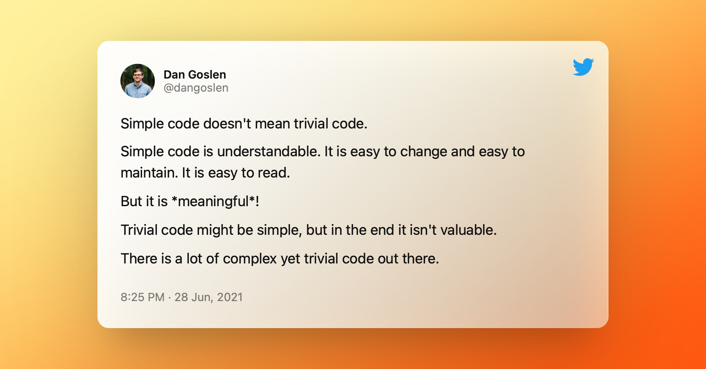

<i>

Photo by <a href="https://unsplash.com/@goshua13?utm_source=unsplash&utm_medium=referral&utm_content=creditCopyText">Joshua Aragon</a> on <a href="https://unsplash.com/s/photos/coding?utm_source=unsplash&utm_medium=referral&utm_content=creditCopyText">Unsplash</a>  
p.s. love the mini-Christmas tree!

</i>

Writing simple code has become something of an obsession for me. 

I find myself trying to simplify any and every piece of code I write. I often add comments on pull requests that we don't need to complicate things or plan too far ahead; the existing code is simple enough to maintain. Why use a pattern if the current code just needs a `switch` statement? If you need to change it later, you will.

Did I just lose all of the clean coders? I thought so.

I want to lay out how an obsession for simple code can lead to better outcomes for your team. Better yet, how an obsession for simple code can often lead you to solve problems faster than when trying to implement something complex. None of this is new - [Martin Fowler](https://martinfowler.com/bliki/Yagni.html), [Eric Elliot](https://medium.com/javascript-scene/the-secret-of-simple-code-a2cacd8004dd), and many more - have talked about this idea for a long time. 

What I want to add to the conversation is that sometimes simple code _isn't_ the clean code we often think of. Simple code might be a `switch` statement. 

## What is Simplicity?

According to the Oxford dictionary, simplicity is:

> the quality or condition of being easy to understand or do.

In software, the "easy to understand" is the key point. We want code that is easy to understand. Why? Because we read code many more times than we write it. 

Moreover, if we want our software to succeed, it must be maintainable. Maintainability requires more than simple code, but it **must** require it. Teams change over time, requirements change even quicker, and even our own code looks foreign a few months after we've written it. We have to keep our code simple so that future developers (inlcuding our future selves) can understand what is going in.

## Simple vs Trivial

Often in the conversation about simplicity, a confusion arises about the nature of simple code. Simple code can easily start to sound like trivial code. But there is a difference.

Going back to the dictionary, triviality is defined  as:

> lack of seriousness or importance; insignificance.

Within the context of software, trivial code would be code that doesn't _do_ anything. It isn't important. You could remove it and all would be well. 

Simple code, on the other hand, _does_ something! It's important! Being able to write important code in a simple way is one of the best guidelines for growth as a software engineer. 

## Abstractions Will Come

When writing software, many engineers fall captive to speculating about the future of their project. After writing somthing simple, they think "I should abstract this for use later on." What usually happens is that the abstractions built are rather cumbersome and difficult to use. 

Instead, we need to focus on emergent design or emergent abstractions. Let the abstractions happen over time and by constant refactoring rather than conjecture about the future. Follow the "three strikes" rule - if you find duplicated code three or more times, you have a need for refactoring and potentially abstracting it away.

Focus on writing - literally - the simplest code to complete a task. Then, simplify it more. 

If you can write the simplest code today, you can refactor that code easier tomorrow. And that is why I'm obsessed with simple code. Because ease of change in the future is critical to the success of software.

## Abstraction is Not Just De-Duplication

When it comes to abstraction, many engineers think of an abstraction as "a collection of shared code for re-use". We take a function, see the code is duplicated, and then move the function to a common place for reuse and declare we have abstracted it away.

But abstractions are much bigger. And much more important. 

As Eric Elliot points out, abstractions are at **the** core of writing simple code. Further, abstractions are what have allowed us to build modern software at such a fast rate. Machine became virtual and data centers became clouds because of abstractions. Bits became files and files create databases because of abstractions.

Abstractions take a complicated thing and present a simplified way to interact with it. So even in our applications, abstractions need to be more than just de-duplicating code. We don't have time in this article to go over concrete examples (though maybe one will come later) so checkout [Eric Elliot's video](https://youtu.be/F-JvvFlYcts?list=PLWOdyjG6bHl54g4o3V-5ooeGnAfqWH6ja) for a _great_ example. Focus on the common behaviors for what to abstract. Not the code to de-duplicate.

---

Write the simplest code you can. Then ruthlessly refactor it as you build out your sofware. Don't worry about the abstractions today - focus on writing simple code and the abstractions will come.

Happy coding!

