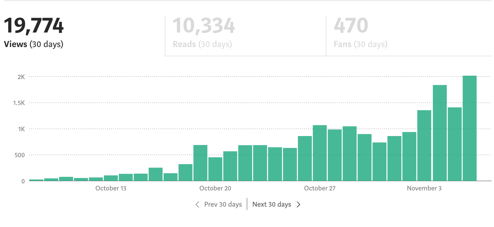

<i> 

Photo by [Aaron Burden](https://unsplash.com/@aaronburden?utm_source=unsplash&utm_medium=referral&utm_content=creditCopyText) on [Unsplash](https://unsplash.com/s/photos/introspection?utm_source=unsplash&utm_medium=referral&utm_content=creditCopyText)

</i>

It was around two years ago that I decided I wanted to start blogging more consistently. I had written a few articles on Medium, but I didn't have any readers at the time. I was just writing into the void.

Since then I've published 50 articles on medium, moved my writing to my own domain built with Gatsby.js, and started cross-posting to [dev.to](https://dev.to/dangoslen). I haven't had the viral success that many bloggers talk about - I've got a lot to learn about SEO and good copy - but I have seen some success that makes me keep coming back.

Today, I wanted to share a few of those successes as well as a few failures on my part. I'll reflect on what has worked for me, what hasn't, and tell you about how this will shape my writing in the future.

## The Beginning

I started blogging because I had just joined a new team after having had a terrible experience on another. I was burnt out and tired. But I was also excited for this new role. 

As a joined, I realized I had something to offer on that team. Not just coding know-how or technical expertise. I had some insights on team culture from past experience being so terrible. I wanted to make my current team the best team I could by offering my experience of what not to do. I started thinking critically about what I could do to help build a great time and worked with the rest of my teammates to implement some of my ideas.

After a little while, I realized that my current team **was** becoming a great team after all. We weren't perfect, but it was a far cry from where I had been. The insights and ideas I had brought to the table were making an impact. 

Maybe others would like to hear this?

I started writing about the things our team was doing that were making us a better team. I wrote about \[code reviews] and why they matter, how [hasty abstractions](<>) can crush your team, and how\[great] user stories() have drive clarity. I also noticed that by writing, I was solidifying my own opinions and learning to express them better with each article.

## Gaining Readers

Like most bloggers, my first articles weren't getting read all that much. Part of this is a failing on my part (hint - I'm bad at marketing). The other part was that I wasn't writing **for** anyone. I was simply sharing my experience, but not writing about how you - the reader - would benefit from reading what I wrote.

In October 2019, though, I wrote an article about [simple code](<>) that started to gain real readers. 

It wasn't a viral success, but it was enough to start to get my views into the thousands for the first time! 

I realized that maybe - just maybe - I something to offer. 

I decided that I needed to publish as quickly as possible. The name of the game, so I'm told, is publishing content all the time. I have some thoughts on this idea towards the end of this article though :)\
\
I published another article on my top 4 design patterns a week later. I got even more views! In fact, it is still my most successful article yet in terms of viewership - though I think I've written higher quality articles since. 

## Getting "Serious"

At this point (early November to late December) I was hooked on writing. I started reading resources on improving my content. I read some helpful books, signed up for a handful of blogging email courses, and created a content calendar. 

This is when I also started to experiment more and more with the topics of my writing. Why? Two primary reasons:

1. It can be hard to come up with unique content all the time. Sometimes falling back on sharing an experience or what you have learned (#todayilearned and #learninginpublic) is all you can do
2. I was curious to see if I could find patterns of what content I wrote connected with readers. Sadly, Medium is very narrow in this regard. You can tag your article with topics, but they are so broad it can be hard to tell what tagged stories are *actually* about. I did find a few patterns that I will share at the end.

But I also started to feel - like a machine. I've come to dislike the term "content creator". Perhaps, I'm a creator. But not a creator of *content*. I like to position myself more as a creator of thought or systems. But this is all a bit tangential :)

## Getting Tired

After a few months of trying to keep a content calendar with a full-time job, going to master's school, and preparing for my wedding - I couldn't keep it up anymore. I was just too tired.

But additionally - I felt like my ideas had actually transformed into, well, *content*. I didn't feel like I was actually bringing unique perspectives or was able to able deep thought to a topic. I was doing what content creators have to do - find ways to write about something I knew, grab a reader's attention, hold it just long enough to read a brief article, rinse, and repeat. 

I'm not judging that approach. I think it's actually an extremely **demanding** regiment to follow. I simply have realized that I want to be at the bottom of things rather than on top of things as legend Donald Knuth puts it. *Not to say I am anywhere near his intellect or ability!*

## What Has Worked For Me So Far

While I don't have the most impressive analytics on this - a gap I am working on correcting moving forward - there are a few patterns I have noticed that work for me. I'm not an expert writer or content strategist (still don't like that word *content*), so this is meant for observation rather than prescriptions for someone to try.

* **Being Vulnerable**

Two of my top three posts on Medium are [My Biggest Mistakes as a Junior Developer](<>) and [I'll Admit It. I'm a Jealous Developer](<>). In each of these posts, I shared my personal insecurities, vulnerabilities, and failures. While I got some criticism for not being insightful or original in either of them, I have to remember that most not all writing has to be insightful or creative to be helpful to someone else. 

* **Topics I'm Passionate About**

Eight of my top ten articles focused on a few areas of software engineering I am passionate about: simple code, effective code reviews, and software patterns. I've also written articles about how to improve the culture of engineering teams through continuous improvement and the danger of "hero" programming that have resonated somewhat too.

I believe these resonated with readers because 1) they could tell I was passionate and 2) it's an area where I can share stories from personal experience (see vulnerability above) and 3) I've worked hard to understand these areas. Combined, this means I can offer **value** to my readers rooted in experience rather than fishing for something to write about. And I think readers can tell.

* **The Right Publication(s)**

My most read articles were all published under a publication instead of just me. But not all publications are created equal. I've found a few publications seemed to get more readers than others. I won't post which publications those are since success with each is dependent on what you are writing about - and I don't want anyone to think submitting to one of them will be a "silver bullet".

While this is last, I think this is really important. Without getting a publication or two to bring in my article, I don't think I would have gotten any readers. If you are considering writing on Medium, don't make it your goal to get a publication to accept an article, though. 

> Focus on high-quality writing and you'll eventually have publications asking you to submit your article to them!

## Moving Forward

With this in mind, I'm trying to re-evaluate where I take my writing for the rest of 2021. I'm still going to be experimenting, but generally, I have three pillars I want to set for how I move forward.

### More Focused Writing

I want to focus more and more on writing about the same topics. When I first started writing I thought I would exhaust all things code reviews or building trust in your teams. I've found there is actually a TON left to write about in both of these domains. 

I've also become much more passionate about the idea of sustainable development - that development teams should be able to maintain a constant pace indefinitely. Everywhere I look I see developers who are overwhelmed, exhausted, and beat up. They are burned out.

> I want to help devs avoid burnout. 

I believe that by following the right software engineering practices and building teams built on trust, that devs can avoid the common burnout problem. I want to focus my writing on helping devs and teams adopt those patterns so that they can avoid burnout.

### Building & Learning in Public

I'm a huge fan of building or learning in public. Sadly, I'm not great at it :sad_face: What I'm planning on doing is moving where I share about what I am building or learning in public to Twitter rather than my blog/writing.

I'm doing this because every time I try to write a whole article on building or learning in public they get too long (this post for example :sweat_smile:). I'm hoping that by focusing on using Twitter to discuss what I'm learning about and building that it will force me to keep those things brief and useful.

## Building Resources

As I've been spending more and more time refining this idea of helping devs avoid burnout, I want to build more resources than just my blog. I've already been building some (very) small \[GitHub] \[Actions] to help automate a few tasks, but I want to build even more. There is a lot of room to improve the monotonous parts of even the best software development lifecycles.

I have a few ideas for some e-books (yes, yes. I know everyone has an e-book) that I would give away and a few that I might charge for. A few topics swirling in my head are surviving your first year as a developer, practicing healthy code reviews, and how to set boundaries at work. I've struggled with those last two, so I hope I can offer some helpful insights.

I'd also like to do more interviews around the idea of burnout. Not a podcast I don't think, but perhaps a newsletter where I interview devs who have experienced burnout. If you have a story about burnout that you think would help other devs, shoot me a message on LinkedIn or Twitter! I'd love to hear about it and see if this idea resonates with others.

- - -

If you've made it this far - thank you! What a long one that was. I write all this because I want you, the reader, to know where I'm going to be focusing my attention in the future. I'm trying to help devs like you avoid burning out. I want to do that through continued writing about software engineering practices, sharing more of what I learn and build in public, and building a collection of additional resources for helping devs avoid burnout in a few sticky areas.

Happy coding!