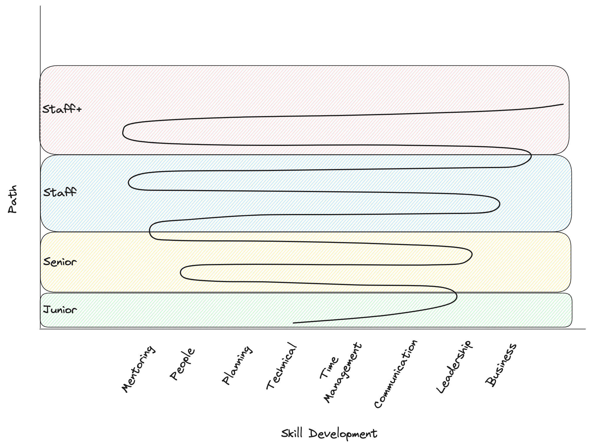

Photo by <a href="https://unsplash.com/@fineas_anton?utm_content=creditCopyText&utm_medium=referral&utm_source=unsplash">Fineas Anton</a> on <a href="https://unsplash.com/photos/top-view-of-trees-surrounding-rock-cliff-5nKYzULQY_M?utm_content=creditCopyText&utm_medium=referral&utm_source=unsplash">Unsplash</a>  

A little over two years ago, I was talking with a Staff engineer on our team. I was a recent hire as a Senior Engineer and had sought his guidance on how to get to the next level. "What should I be focusing on to get promoted?"

His initial response was simple: "What got you here won't get you there."

That bit of wisdom has stuck with me ever since. I remember that phrase every time I wonder about what to focus on in my role. It reminds me I always need to learn new skills and strengthen my existing ones regularly. I can't keep doing the same things in the same way and expect time to compound those skills to be enough to get to the next level. 

Much has been written on the topic of navigating the technical career ladder. From Will Larson's [StaffEng](https://staffeng.com/) (highly recommend, by the way) to newsletters such as [High-Growth Engineer](https://read.highgrowthengineer.com/) and many others, there are numerous resources to help you frame your career and learn how to grow.

As I've been reflecting on this recently, a new "view" of growth has entered my mental model, helping me understand a bit more why it can often feel so frustrating or exasperating as you work towards the next level of your career. It's helped a few of my mentees, and I think it can help you.

## Growth Isn't Linear (and Not Always Exponential)

The most important thing to remember is that growth is not linear. You might grow quickly into a senior role and spend some time there before pushing to a tech lead or staff role. Or you took a while to get to senior but were able to quickly advance to a manager role shortly after that. You also might find yourself wanting to switch from a technical role to a product role or from an individual contributor to a manager (and vice versa).

Whatever your path looks like, don't get discouraged by where you are at or how long it's taken you. Don't fall into complacency, but don't get stuck in self-pity either. A key part of growth for anyone is remembering to have a growth mindset and reminding yourself that you haven't achieved x _yet_.

A sample career growth over time chart might look similar to the graph below. Remember: this is _not_ prescriptive nor descriptive of any particular career arc or ideal path. It's simply an example to show the non-linear aspect of career growth.

As you can see, growth isn't linear, and it likely won't be a nice exponential curve either. Instead, you'll experience times of slow growth, times of a plateau, or even times of a decline mixed in with seasons of quick and fast growth. These points of quick and fast growth are what I call inflection points.

## Inflection Points

As we just mentioned, growth is often not a steady predictable curve. Our growth tends to happen in fits and starts. We might spend a while struggling to improve a specific skill set only to quickly get promoted once we have figure it out.

These moments of rapid growth are the inflection points on the graph in the previous section. They come in various forms:
The difficult projects that stretch your technical expertise
The conflicts that require high emotional intelligence to resolve
The outages that demand strong leadership to navigate 

Whatever the cause, these moments are catalysts for growth. Don't be afraid to embrace them. In other words, inflection points come in the form of challenging opportunities that you have to be ready for.

Understanding how inflection points operate is how many engineers find the "speed run" capability to fast-track themselves to a new level. Once you find something impactful, you've gotta lean in. [Ryan Peterman](https://www.linkedin.com/in/ryanlpeterman/), a Staff Engineer at Instagram, writes about this speedrunning concept in his newsletter [Developing Dev](https://www.developing.dev/p/speedrunning-guide-senior-l5-staff). He says the following (emphasis my own):

> When I was an L4, I _stumbled_ upon some L6 scope without realizing it. I had strong _initiative_ so I started solving problems without thinking through why it was impactful. I got lucky that the work had L6 impact.

I also appreciate that Ryan calls out something often overlooked in such newsletters: a bit of luck. Nearly every engineer that I've talked to has gotten to Staff mentioned that a bit of luck is required. They key is, as Ryan points out, you can't sit around and wait for the lucky opportunity. You have to keep your eyes open for chances, invest some effort, and get better at identifying the right impactful ones as you go along.

## Broadening and Deepening Skills (Switchbacking)

While all of the above points are helpful (I hope!), they are familiar to the discussion of growth and career progression. 

I hope to add to the discussion how I've started to view the skill development required at each inflection point above. While you need impact, a bit of luck, and grit, you also need a framework for understanding the skill development associated. You need to understand where to focus your energy.

As [Sahil Bloom](https://www.sahilbloom.com/) talks about, people often look for opportunities without investing time in skill development. If you find a great opportunity but haven't developed the proper skills to take it on, you'll miss out.

To be clear, you don't need to have mastered every skill required to take on a new challenge. Challenge is how we grow! You have to find the opportunity that matches Flow sate: just beyond your current skills, but not so far that you're likely to fail.

To be prepared for those opportunities, you must develop your skill sets along the way.

The new "view" I described earlier was understanding that this skill development looks a lot like switchbacks on a trail. Switchbacks are a way to climb a mountain that involves the trail going "back and forth" up the mountain rather than a direct line (sounds like growth, doesn't it?). In this context, the switchbacks are "upside down" - instead of getting smaller as you climb higher, they only get broader.

As you hike the switchbacks, you'll often pass the same scenery over and over again but gain new perspectives as you climb higher and higher Eventually, switchbacks will naturally move to a new area or section of the mountain. You'll keep doing the back-and-forth pattern but cover different terrain. It won't happen all at once, but you'll suddenly realize, "Oh, this is different now."

It seemed to me this is how we tend to develop our skills: at each level, we will both broaden our skills through acquisition (learning new leadership, business strategy, or people skills, etc.) while also deepening our existing skills through new perspectives and repetition (learning the nuances of communication, building better judgment of technical decisions, etc.). We gradually climb higher and higher, even though the incline itself is (usually) not so steep. It might look something like this.

Of course, there will be times when the incline is steep and be the only path up the mountain. These are those inflection points from earlier. You'll need to be on your A-game and lean into the incline rather than resist it. You'll have to broaden and deepen your skills while keeping your balance.

In these situations, a great mentor or manager is invaluable. They will help you understand which skills to spend more time on and which ones to defer for another time while also providing enough balance so that you don't tumble back down the trail. After all, pushing at these inflection points is a lot of work! It's better to take a breather and rest than push yourself so far that it all comes crashing down.

---

I hope you take away from this article that no matter how high up you get in your career or whatever roles you pursue in your career, you'll never get away from a two-fold approach of broadening and deepening your skill set. I'm in the middle of doing both right now, myself.

When and which skills to focus on will be different for everyone based on their working environment, mentors, and even managers. But continually looking for chances to learn and develop new skills will never be time wasted. Take the changes and switchbacks in stride, learn to recognize when they are coming, and you'll be on your way to a great career.

Happy coding!

