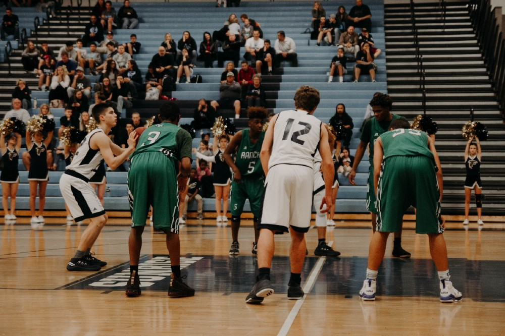

I've been a part of a few teams in my short carrer. I've been part of brand new ones and joined well estasblished ones as well. 

While I have many ways to grow, I've thought through some ways that have helped me when I've joined existing teams. They aren't exhuastive be any means and I'm sure others have even better ideas for how to join a team. These are just the ones I've used. I hope they can benefit you too! 

## ❓Ask Questions.

The fastest way for you to become a contributor to a team is to understand the team you are on. How they work; what they work on; why they do things in certain ways; what they expect of you. You need to figure all that out, and the best way is to be upfront and ask.

Don’t be afraid to ask the “dumb” or “silly” question. Dumb and silly questions usually result in simple pieces of information that you didn’t know before, or they reveal something is broken. Asking “Why do we do things like that?” or “How did this get this way?” will be sure to expose the shortcomings of your existing team, or expose how they have figured out a new paradigm you hadn’t considered.

Also, do your best to ask a question as few times as possible; i.e. actually listen to and learn from their answer. Otherwise, you will be annoying your teammates.

I have accomplished this if by keeping a list of the questions I ask and their answers. I usually keep this in something simple like Evernote or old-school pen and paper. I try to resort to that list first if I don’t understand something. If I don’t find it in my list, then I will ask a team member.

The best thing about this approach is I have already set up others for success in the future. When another new team member joins, I will have already compiled an FAQ of sorts to give to them so they shouldn’t need to ask the same questions. And of course, I can document it all in a wiki, README, etc. Which leads to the next point 👇

## 📖 Read the Docs. And Then Fix Them.

Documentation is always broken. But that doesn’t mean it isn’t invaluable. I believe [documentation is a tool](https://medium.com/@dangoslen/documentation-isnt-a-chore-its-a-tool-ca384db0af8) that continues to refine and build a team’s understanding of what they do and why they do it. So read the docs. And I mean read — avoid skimming if you can.

As you do, ask questions (see above), compare what you read to what you are told, and then fix the docs when they are wrong or missing information. If you are on a software team, open a PR. You’ll likely get feedback and thus answers to more of your questions (see above).

Then read it all again. And again. Until it starts to make sense.

We had someone join our team at [Bandwidth](https://www.bandwidth.com/) ([we’re hiring](https://www.bandwidth.com/careers/) by the way!) a few months ago and the first thing he did was read. He read every doc we had ever written about the solution we were building. He read code for hours. We even got nervous because he was sitting and silently reading every day for a little over a week. 😬

But then one day it knew it all. Like, **really deeply understood the solution we were building**.

He spoke up one day about a feature and how it fit within our system. He described it better than our architect at the time did. He had spent so much time reading, that when it came time for him to write something and make a new contribution, he knew exactly what it meant.

> “Not all readers are leaders, but all leaders are readers.”
>
> — Harry S. Truman

## 🤝 Serve.

Serve your new teammates. I don’t mean bring them coffee and donuts (though a lot of people like those things, so maybe it isn’t a bad idea). Learn what the things are that no one wants to do or no one has had the time for. Figure out how to do it, execute it, and then make it better for the next person that needs to.

Are there silly little tickets that you can clean up? Are there any big tickets that no one wants to take? Be the one to do it. And as you do, be asking questions, reading and correcting everything you can. The benefit of this is that after a few months, you will have done some the hardest work you will do on that team. Everything else is downhill.

## 😔 Admit When You Screwed Up.

At some point, you go from being the “new guy/girl” to having real responsibility. And you will, sooner or later, screw it up. You botched a customer call, setup something in a system wrong, wrote a bug that made it to production, etc.

When it happens, don’t make an excuse, blame a system, or claim you didn’t know something. If you’ve been doing the things above, you shouldn’t *really* have those excuses anyhow.

Fess up, fix your mistake, and learn from it.

By doing so, you practice humility. You learn to own your mistakes quickly. You show your team you are willing to fix whatever mayhem resulted. Most importantly, it shows that you are actually **doing** something! No one sitting on the sideline of the Superbowl makes the big mistake that cost the game if you lose; they also never contributed to the victory if you win.

## 🍽 Grab a Meal With Them.

Seriously, [grab lunch together](https://www.inc.com/jessica-stillman/the-team-that-eats-together-stays-together.html). Eating together helps you build relationships beyond work. You get to know your teammates outside of the things they “do”. Its time for brainstorming ideas in an informal way that you can’t do at a whiteboard in a stuffy conference room. It doesn’t have to be daily or even weekly either. Just be willing to ask a few co-workers every once and a while.

As a side, happy hours are great too, but be careful! No one wants to be known as the office gossip and it can be easy to fall into a trap after a few drinks. Even if you aren’t saying anything, what you hear can be equally as dangerous.

- - -

I hope this was a helpful quick snapshot of how to crush the game as a new team member. Many of them are good strategies to becoming a better team member of time as well. The core of all these things comes to down to that balance between staying humble and staying hungry.

I’d love to hear what you think is important too. What are some other ways in which you or others have had great impact when joining a new team team?