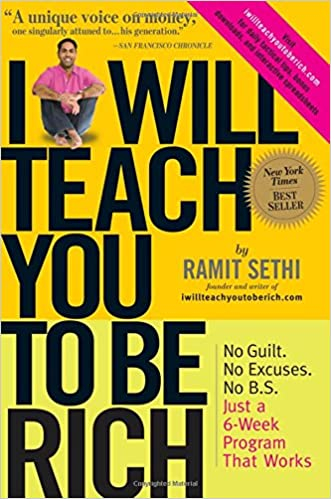
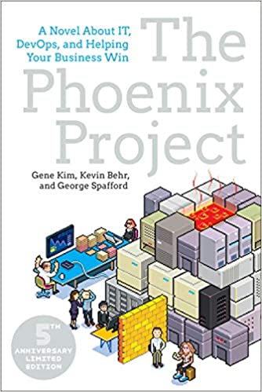
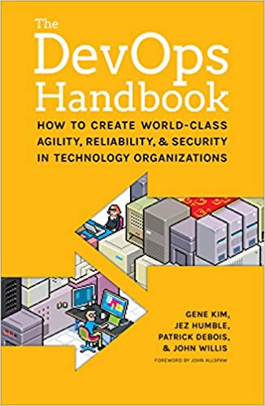
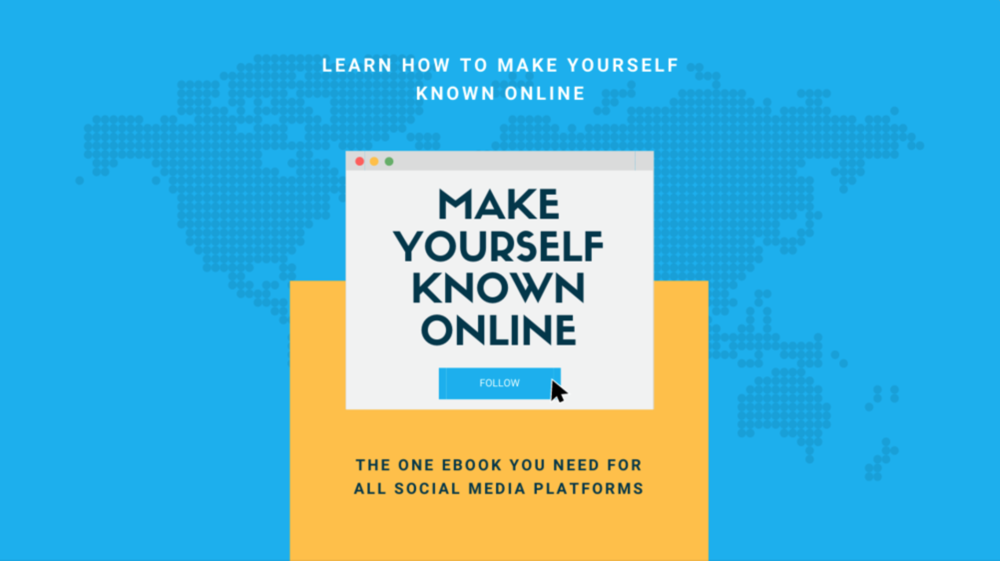
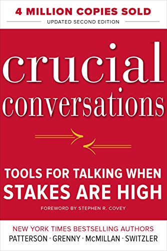
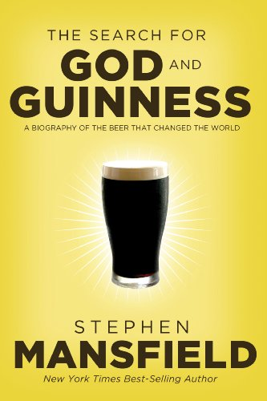

Every year I try to take a short inventory of the books I read through that year. I find that doing so helps me solidify the concrete things I learned from each. You can see [last year's list](http://bit.ly/dg-books-2019) too if you would like.

Let's jump right in.

## *[Crime and Punishment](https://amzn.to/3515l2g)* by Fyodor Dostoyevsky

One of the classics, *Crime and Punishment* takes us through the minds of several Russians in St. Petersburg following a brutal murder. We explore the psychological and relational consequences of murder, the motivations for it, and how society plays into all of it. A difficult read, this story will help the reader grapple with morality, mortality, and the power of confession.

## * [Artemis](https://amzn.to/3oaCTTf)* by Andy Weir

Andy Weir's follow-up to *The Martian* is set on the first human colony on the moon complete with smugglers', corrupt politicians, and failed heist attempts. While full of science(ish) stunts and explosions, the plot is underdeveloped, moves too quickly, and doesn't quite grip the reader. While entertaining, I don't believe Weir's imagination went far enough in some places, and in others was too lofty with situations and events that are hard to believe - even on the moon.

## [I Will Teach You To Be Rich](https://amzn.to/2Mo8C5n) by Ramit Sethi

Personal finance is a mine-field of advice from the rich, the poor, your parents, and everyone in between. *I Will Teach You To Be Rich* aims to help those trying to gain control of their finances to create a simple plan to help them spend money on what they love, save it for the future, and invest to become wealthy. If you have never read a personal finance book and are intimated by a 401(k) account, this is a good place to start. If you already have a plan and are trying to see what you can improve, Ramit will help you take your plan to the next level; just be prepared to skim through sections you already know. Anyone trying to grow their financial prowess will benefit from this book.

## [The Phoenix Project](https://amzn.to/38Ytbx7) by Gene Kim et al

I technically finished this right before 2020 but didn't have time to write about it. *The Phoenix Project* follows a newly promoted IT director at a crumpling auto-parts company as he navigates how to re-build the department. Developers, IT team members, and project managers alike will all find humor and relatability in this saga of trying to get work done on time and under budget. A big take away for me is the importance of improving daily work; improving how we work is more important than the work itself.

## [The DevOps Handbook](https://amzn.to/38XG7TR) by Gene Kim et al

*The DevOps Handbook* has become a de-facto standard for tech organizations over the past several years. The handbook discusses how teams that have traditionally been split into development and operations focused groups can work together in ways to ship products faster, maintain them better, and reduce complexity. While not a silver bullet for an organization, the book explores how organizations that create a culture of trust succeed by releasing frequently, investing in automation, and collaborating across functional groups.

## [Improving Your Online Presence](http://bit.ly/gr-online-presence) by Catalin Pit

[Catalin Pit](https://twitter.com/catalinmpit) became a voice for web developers in 2020. He has an ability to connect and relate to developers around the world, while still being informative and helpful. While I found his book to be fraught with grammar issues and choppy sentences, it is impressive someone went from being unknown to having a published book in a few short months. The core takeaway for me about my own social media presence was that to succeed, you can't just tweet or post into the void. You need to find people to interact with and connect with. Who knew that would actually work? :

## [Crucial Conversations](https://amzn.to/3rHkAHD) by Kerry Patterson et al

*Crucial Conversations* is a classic leadership book on how to manage conversations (and really relationships) when the stakes are high. This is a book of simple ideas and principles, but they take a lifetime to master. A major takeaway for me is that when people don't feel safe, they don't communicate well. And when teams don't communicate well, they fail. This is a book I believe I will re-read over and over again.

## [The Search for God and Guinness](https://amzn.to/2KXIUEz) by Stephen Mansfield

Before reading this book, I had never thought much about the Guinness brand. I've honestly never even had a pint of it. But from reading this book, I have learned how much of an impact a business can make on a community. From the humble beginnings of the Guinness brand for sheer survival to how they paved the way for modern company educational programs, this book is an inspiring read for anyway wanting to shape their community for the better.