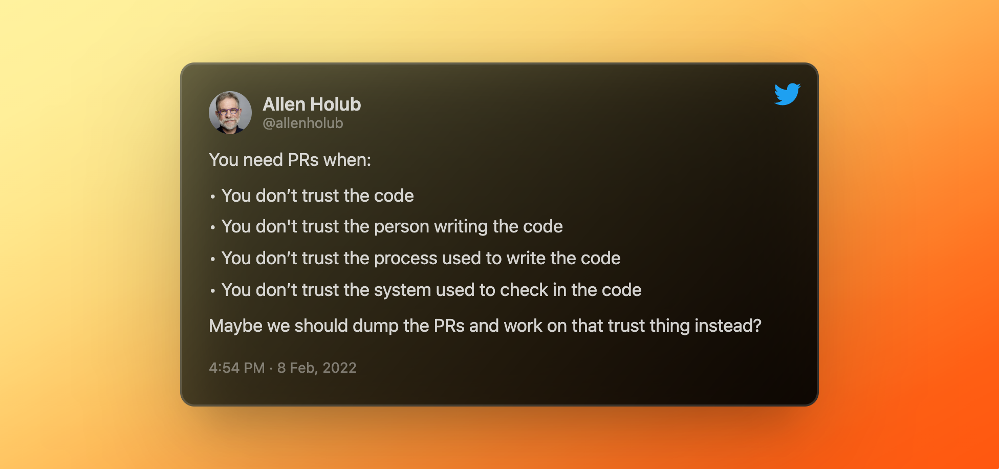

<i>Photo by <a href="https://unsplash.com/@janasabeth?utm_source=unsplash&utm_medium=referral&utm_content=creditCopyText">Jana Sabeth</a> on <a href="https://unsplash.com/@janasabeth?utm_source=unsplash&utm_medium=referral&utm_content=creditCopyText">Unsplash</a></i>

 

The other week I saw a pretty upsetting Tweet by Allen Holub. Holub is an Agile coach and software thought leader. A lot of his focus is on helping teams get away from process and "Agile-ish" workflows to workflows centered on team productivity.

He wrote the following:

<i><a href="https://twitter.com/allenholub/status/1491168642586710016">https://twitter.com/allenholub/status/1491168642586710016</a></i>

This kind of statement isn't unlike Holub either, and his style tends to be controversial and intentionally provocative. His whole business relies on convincing people he has a better way to do Agile, which means convincing people they need his help. 

I usually don't find his takes offensive or frustrating. Even if I disagree with his perspective, he usually brings a helpful insight to think through. However, I find his statement baseless and naive in this particular case. I've even [written about the subject of code reviews, pull requests, and trust before](https://dangoslen.me/blog/lets-talk-about-trust/). Using a tool doesn't mean there is no trust. It might be a symptom, but not enough to diagnose a disease.

I mention all of this because I'm beginning to grow tired of harsh definitive statements like Holub's. I don't believe it helps the software engineering community grow and learn. Are there times we should voice strong opinions? Absolutely. And yet, the best declarations of an opinion also make it clear the idea is based on individual experience and offered with humility, knowing they don't know everything.

All of this got my head spinning, so I reflected a bit deeper about the whole concept of thought leadership. What makes someone a thought-leader? Are they always right? What is their role in our software communities?

I don't know all the answers, but here are some of my thoughts.

## What is Thought Leadership?

Thought leadership is a bit hard to define. Like many high-level ideas - you know it when you see it. A good starter, though, is the definition from Oxford below:

> intellectual influence and innovative or pioneering thinking

In the age of social media and content, the word "influence" is particularly critical. Many people around the world want to gain influence because, in our current society, influence can lead to profits. While influencer and thought leader are not synonymous, there is high overlap.

But the original intention of this term influence came much more from the influence of someone's work. They had shown examples of their thoughts were innovative or pioneering through their career.

Now before going further, I'm not trying to say that thought leaders today haven't earned their status to become one. They have indeed. However, the motivation to become seen as one is different than maybe it once was. We'll dig into why as we go further. Let's take a look at who these thought leaders are.

### Who are thought leaders (and where do we find them)?

In the internet era, you can find thought leaders anywhere. Some write blogs (codinghorror), some Tweet or post on LinkedIn. Others still have an old-school approach and write books or papers. No matter the medium, many gain an audience of followers on social media platforms or in niche circles.

Turning specifically to software engineering, many thought leaders are either engineers who wrote about their experience building software or wrote about the feats of technical mastery they accomplished. The engineering industry has built a collection of books/papers often viewed as cannon for how to build software. These are books like [Clean Code](https://www.goodreads.com/book/show/3735293-clean-code), [Pragmatic Programmer](https://www.goodreads.com/book/show/4099.The_Pragmatic_Programmer), or [Designing Data-Intensive Applications](https://www.goodreads.com/book/show/23463279-designing-data-intensive-applications). Papers like [Google's MapReduce](https://static.googleusercontent.com/media/research.google.com/en//archive/mapreduce-osdi04.pdf), or [Roy Fielding's dissertation](https://www.ics.uci.edu/~fielding/pubs/dissertation/top.htm) are also esteemed by many engineers.

Since the area of software engineering and computer science is so vast, the space for a thought leader is as well. Some focus on process and others focus on specific breakthroughs in building computers themselves. Effective thought leadership also includes creating a bit of a niche so that the ideas being promoted can be clear and hyper-specific.

You can also find thought leaders in incredibly vast and niche spaces. In recent years, many young influencers and thought leaders have turned to Twitter or LinkedIn, while many others stay focused on writing books, papers, or speaking at conferences. They aren't mutually exclusive, of course; the most well-known do some of each. 

### What is their role?

So we've established that thought leaders tend to be influential people who have built a reputation for original, innovative, and pioneering thought. But what is the point of that? What is their role in our software engineering communities?

The obvious answer is they are teachers. They are showing us a different way of doing things. They are helping us learn what it means to be great as engineers. Some might do this by research and pushing the boundaries of computation. Some might be great synthesizers, collecting various bits and pieces into one bible for other engineers.

And yet, thought leadership in my mind is different than being a guru or a coach. Thought leadership is detached from the person or team hearing their ideas. While those ideas likely grew out of a specific team or context, or experience, the idea often has to be positioned in a different way. When trying to train or teach multitudes (like what thought leadership is doing), the ideas and perspectives offered need to be both flexible in how they relate to different contexts and also strong enough to hold weight. 

This often means we get provocative or controversial takes - like the one from Mr. Hollub that I referenced earlier. He doesn't offer "I've noticed that teams that heavily rely on pull requests and have review cycle times that range in weeks instead of hours tends to have a deeper issue of trust." Instead, he takes a hardline position that _any_ team that uses pull requests has an issue of trust. It might not be totally true, but it certainly is more thought-provoking.

### Should we listen?

The simple and obvious answer is, well, yes. Of course, we should listen. 

But - and here is where I hope I can add to this discussion overall - we don't need to accept whatever they say as truth. Kent Beck - a leader in his own right - expresses this well when he talks about how what we've learned so far isn't dogma. He pushes us to continually think and question our processes and patterns to find new ways to work.

If we blindly listen to everyone and their opinions, we will quickly find ourselves racing in circles, getting nowhere. We never question if that helps our teams or hurts them. There are simply too many opinions, too many nuances, and too many ways to be effective as a software team. 

As an example, we like to talk a lot about maturity models in the industry. We all seem to accept that different teams have different levels of maturity and capability. I don't think it makes sense, then, that we expect organizations at different maturity levels to react the same way to an idea, opinion, or tool. Each team at different maturity levels will need to integrate those learnings differently. We should listen, think critically, and apply learnings to improve our team.

## Tools in Your Toolbox

Thought leaders are, therefore, offering their perspectives and teachings, and we have to be disciplined and mature enough to understand what to do with them. Treat their perspectives and teachings as tools in your toolbox. Just as a craftsman adds tools - both general and specific - to help them with their craft, we as engineers should be adding tools to ours.

These tools often are in the form of situational awareness: when this team problem is happening, we can use this tool to help. As an example, if bugs are frequently detected in a software product, there are a handful of tools we can leverage to help: automated tests, code coverage reports, integration servers, product demos, etc.

Knowing when to use each and which one will be the most effective is the art of software engineering. And the context is most often missed by hardline statements on the internet.

And yet, we need to have the tools in the first place. And so, we should be listening. We need to be paying attention to the the thoughts and trends in our industry. But we need to listen carefully, think critically, and be judicious about when to deploy the tools we have.

Happy coding!