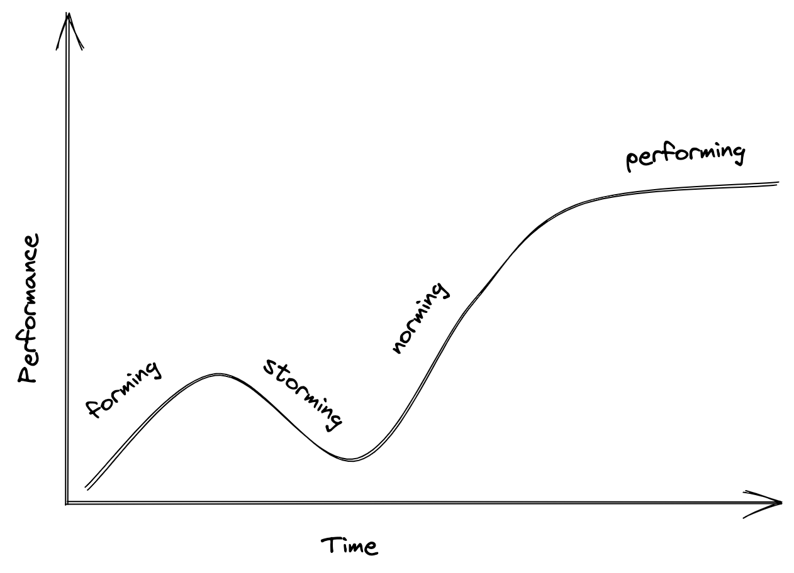

Photo

<i> 
    
Credit

</i>

Working as a software engineer in today's world often requires working with other people. The top tech companies, fintechs, and even up-and-coming disruptors organize their engineers into teams with specific missions, goals, and ownership. It might be the fabled two-pizza team or it might be a team of ten or more.

Learning to work well within a team is critical to your success as an engineer. The notion of the hero programmer or the lone ranger won't get you far. The top engineers are ones that [accomplish through others](), by mentoring, teaching, and shaping the organizational culture.

But the thing about teams is that they change. New members join, old members leave, re-orgs. create brand new ones, etc. And when this happens it can be hard to adapt to the change. 

But it's paramount that when these changes happen that you do adapt. Otherwise you will get stuck in the past?

This begs the question: how do you adapt? How do teams change?

A lot of research has gone into how teams form and perform (which we'll get into it soon). But at the core is being able to adapt and be flexible.

And that makes me think of Bruce Lee.

## Be Like Water

I'm not a big kung-fu movie buff. But I've still heard of Bruce Lee.

Bruce Lee was one of the world's best martial arts movie stars. Not only did his master his craft of martial arts, but he was a master filmmaker and even a bit of a philospher. 

And there is [one quote of his](https://www.goodreads.com/quotes/29138-be-like-water-making-its-way-through-cracks-do-not) that exemplifies how to adapt on a team.

> Be like water making its way through cracks. Do not be assertive, but adjust to the object, and you shall find a way around or through it.

What does this mean in context of navigating team changes? I think it means simply: be flexible. Don't try to push your agenda over others or force you will on the team. Instead, find the paths or the directions of the team you can follow to create momentum for your team and its goals. 

An example of this from my experience on a team change was around alerting. When I joined a new team several years ago, they had a very intense alerting process. I wasn't used to such a vigrous process for the on-call engineer and it was a bit annoying quite frankly.

Over time, I realized how incredibly helpful those alerts had been to keeping our team's SLA intact. But, after a while, I realized that there were only a handful that needed to be addressed. I worked with the team to limit the number of alerts we had to only the most critical ones. 

The effect was that we improved the process for on-call engineers, giving them more time to work on other improvements than always checking alerts that wound up being not a big deal. 

If I had stood up on day one of joining that new team and proclaimed "We have too many alerts" I would been told "But these alerts have kept our SLA. We can't change them." But by joining the team, being flexible and adapting to the team's processes, over time my suggestion to reduce the total alerts was welcomed because I was now a _member_ of the team rather than being perceived as an outsider.

Which prompts another interesting viewpoint: what does it mean to be a member of a team rather than just being a new person on a team? What does being a team even mean?

It's a great question full of research from tons of angles, but today I want to focus on just one model: the Tuckman model.

## The Tuckman Model

The [Tuckman Model](https://en.wikipedia.org/wiki/Tuckman%27s_stages_of_group_development) is a general model used to describe how groups move from becoming a set of individuals, to being part of the group. It describes the process of moving from "the team I work on" to "my team."

In this model, the team goes through four distinct stages: forming, storming, norming and performing.

### Forming

In this stage, the team is trying to understand two core questions: 

1. what is this team and what does it do? 
2. how do I fit into it?

Team members are often motivated, polite, and willing to give their best effort. But they are still trying to figure out the practices of the team, the goals of the team, and might start testing the boundaries of what is acceptable. 

It's crucial in this stage to ask questions that helps clarify the team's goal. It's also important that the team works together to agree on those goals, as well as things like vocabulary, regular meetings, and expectations.

If you are a leader or more experienced engineer, this is a great time to go first. Junior engineers will be looking to you to set the tone and culture of the team. Don't be aggressive in trying to assert your own agenda (be like water), but you can should be going in first in asking questions, suggessting ideas, and publicly supporting ideas from others that you think will be helpful

### Storming

The storming phase is exactly what it sounds like: the team starts to grow charged with tension, opinions, and disgareements. It often will happen that teammates will have grown frustrated with each other's behaviors and are finally feeling safe enough to express their frustration. Performance starts to drop as the team is now more concerned with _how_ they achieve their goal rather that what that goal actually is.

Most engineers would want to skip this phase. And why wouldn't you? It's never fun to be on a team with tension or conflict happenning.

However, you aren't powerless during this stage. Don't ignore the tensions or conflict. I've been on times that tried to pretend it didn't exist and it only grows worse. 

While there is not perfect way to handle any disagreement or conflict, one thing I'd advocate for is turning to your manager or team leader. Describe what you personally see and things you would like to change. If you are struggling to work with someone specifically, ask for guidance on how to discuss it directly with that person from your manager - but avoid gossipping or creating tribes within the team.

Remind each other (and yourself), that everyone is trying their best. Work to overlook small differences in style and instead look for what you can learn from each member on your team. You want to create trust between the team, and trust has to be both earned and given. 

If you are willing to tackle the storming phase head on you will minimze the duration and itentisity of this phase allowing you to move to the third stage stronger than ever.

### Norming

Norming is the tail end of storming and continues as the group begins to tolerate each others differences, while also establishing the patterns and culture of the team. 

In this stage team members also learn a deeper sense of what they can contribute to the team. As this happens, it is important each team member has opporutnities to make contributions that they find meaningful without. If you are a leader or experienced engineer, look for ways to empower your team members to do just that.

This stage can continue for a long time, and that's ok. This process is vital for cementing long-term culture and behaviors that will carry the team into long-term success.

Use tools like [retrospectives]() and blameless post-mortems so the team can see where they have room for improvement and define action items to do so. 

### Performing

After the period of norming is the performing stage. This is when things are going great for everyone on the team and the team is achieving their goals.

In this stage, though, it is important to allow for "re-norming" stages to occur. This might happen after an outage and a process changes need to be made. Or perhaps the team has gotten a little too lax in their efforts and need to put more in. 

Whatever the case, it is important to remember that small re-norming (or tuning stages) are critical to the team continuing to perform. The best sports teams in the world don't coast on the success from last season; they constantly ask how to get better.

## Swarming

In software, there is another important stage that is apart from the typical model: swarming. 

You've likely heard of swarming as an activity for a team to do when something has gone wrong or their is a high priority problem to solve. Everyone on the team is contributing ideas, code, research, etc. in order to solve the problem as quickly as possible.

A benefit of swarming is it acts as an immediate goal for the team to accomplish. If the team can effectively swarm and solve a problem, it will act as a quick win for the team, showing them that they _can_ indeed succeed.

Swarming is an extremely helpful stage in the middle of the storming stage. With careful leadership and direction, it will help the team realize that some of their misgivings about each other are unfounded and that they can work better together than expected. 

---

The last bit of wisdom I'll leave you with is a quote (and I can't remember for the life of me where I heard it but seems to come from [this Tweet](https://twitter.com/RichRogers_/status/908480580190445568)):

> Teams are immutable. Every time someone leaves, or joins, you have a new team, not a changed team.

This is important because it means that not only will the Tuckman Model apply to a brand new team, but _any_ change in personnel. This includes someone joining your team or you joining another. In all cases a new team is formed.

You are likely to go through several teams in your career. Whenever you do, you have to remember you are actually creating a new team. In every case you'll have to be like water and adapt.

This will mean learning humility in some cases. In others it might mean learning to ask questions. In some it might mean practicing empathy or starting to mentor others. 

It will also server you well to remember the Tuckman Model as you navigate your new team. Use it to to anticipate conflicts and how the team will perform. Know that there will be times to lean-in - to "embrace the suck" - and times to consider asking for help. 

But if you be like water, you will form a truly incredible team. 

Happy coding!