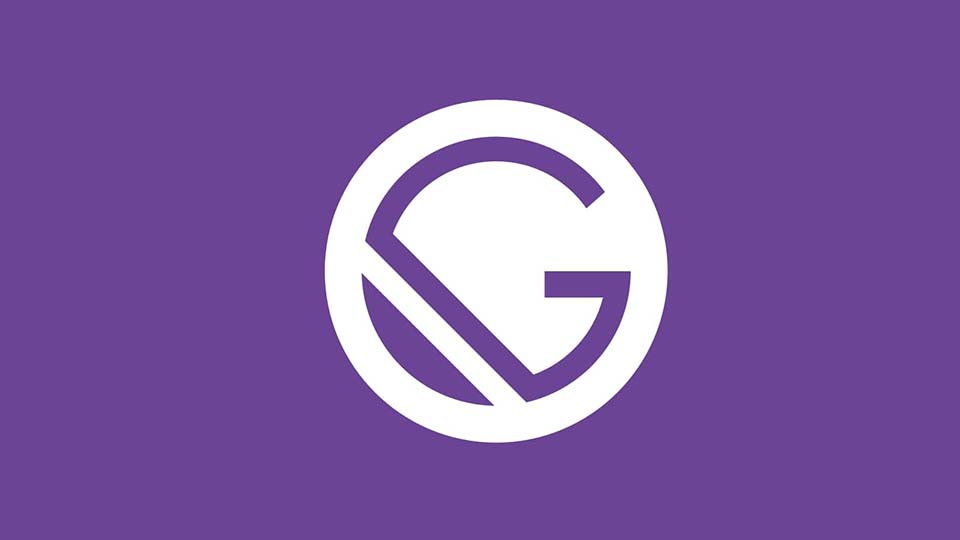

A few weeks ago, I realized I needed to update my website. I have had dangoslen.me for a while, but it was only a landing site with a few links to other content sources. I've since started blogging a little more on [Medium](https://medium.com/@dangoslen) and [Dev.to](https://dev.to/dangoslen) so I decided it was time to own my content and build a blog.

There was just one problem: I'm a backend developer. 

### I used to be a full-stack developer. 
But that was a long time ago (5 years in human years => 40 years in dev years right?). Since then, the entire landscape of frontend development has changed. 

We know write javascript to generate `.html`?

What is JSX? ES5? What is this Typescript thing?

It was all a little overwhelming, but I decided I should learn something new. I did some searching and reading and learned about these things called static site generators (SSGs). After some thought, it seemed like one of these SSGs would be a great way to build a simple blog and website, so I decided to give it a try.

Here is how I went about it.

### Choosing the SSG
The first decision was really which SSG to use. There are a number of them out there,  . I gave cursory look at each of them but ended up picking [Gatsby](https://www.gatsbyjs.org/). Why? I would like to say it was a scientific study complete with measures in build time and interviews with developers who had used each.

Ultimately, I just choose the one that when I started was simplest for me to understand. Gatsby just happened the one that "clicked" with me first. This is largely because of this [tutorial](https://daveceddia.com/start-blog-gatsby-netlify/) and the [starter blog repo](https://github.com/gatsbyjs/gatsby-starter-blog) built by Gatsby themselves.

### Choosing the CMS
This decision was honestly already in the bag. Partly because the starter repo I mention above was built for [Netlify](https://www.netlify.com), so why try something different?

The other reason was I had played around with Netlify before and had loved it already. Kent C. Doods had written about how he uses Netlify and he made it look really simple. I took my existing dangoslen.me repository, set it up in Netlify, and boom: working website. It went so well I even transferred my domain and I've been hosting it on Netlify ever since.

### Building the Thing
Once I had made these decisions, I did what every developer says to not do: just started coding. I cloned the starter blog repo and started breaking things immediately. 😂

I eventually sat down and did some reading on the basics of Gatsby. I went back to the tutorial from earlier and actually read it instead of just skimming it.

I was also new to GraphQL. I knew about at a very high-level, but had never played with it before. [Gatsby's Data Layer tutorial](https://www.gatsbyjs.org/tutorial/part-five/#introducing-graphiql) was helpful for me to learn how Gatsby uses GraphQL to render images, return configurations, etc. 

### Deploying and Blogging
Once I had tweaked and changed the site presentation to my liking, deploying was a piece of cake. I simply followed the steps outlined by Netlify CMS on how to deploy a site to Netlify and setup GitHub authentication. _It seems intimidating, but I think you can do it!_

Instead of deploying directly to dangoslen.me, I instead deployed to a sub-domain. This allowed me to work on blogging and make tweaks without impacting my actual site since it was already live.

From here, I started working on posts (like this one!) by just going to `/admin`. I logged in using GitHub and was off to coding. I started bringing over old posts as I could from Medium and updating those to have links back to my site since this is where I want all of my content to live. 

---

At the end of the day, I was sooo surprised at how straightforward it was to create a customized blog for myself. I remember my first Wordpress site or my first attempt at deploying my old hand-rolled site - we have come a long way. 

To all of the developers who have worked on these technologies - kudos! Now I have the ability to create the site I want, so that I can share my stories and experience with others.

Happy coding!

