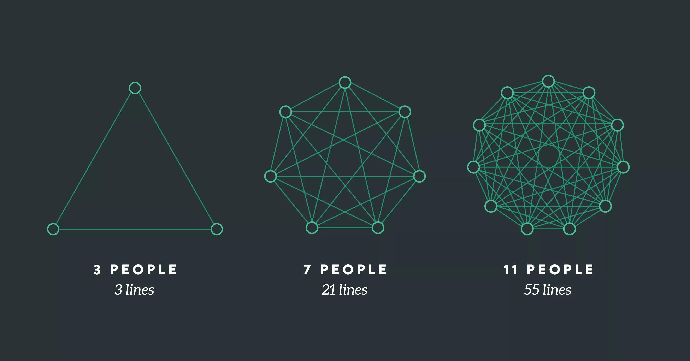

<i>

Photo by <a href="https://unsplash.com/@calum_mac?utm_content=creditCopyText&utm_medium=referral&utm_source=unsplash">Calum MacAulay</a> on <a href="https://unsplash.com/photos/closeup-photography-of-brown-analog-scale-TU1b56dfn2A?utm_content=creditCopyText&utm_medium=referral&utm_source=unsplash">Unsplash</a>
  
</i>

"Does it scale?"

This is a frequent and familiar question in the software world these days. In the world of SaaS and the ability for software users to ramp quickly, we all want to make sure our software scales.

But there is a lot to this question that we often miss. For example

* Are we scaling users? Concurrent sessions? Requests per second?
* Does it _need_ to scale?
* How will we scale? Horizontally? Vertically? Both?

This last question sometimes gets overlooked in our technical discussion. In my view, it gets ignored due to the current industry "best practices" around application architecture. Pay-as-you-go cloud services (AWS, Azure, etc.) and the shift toward micro-services have pushed most of the industry toward horizontal scaling (which isn't bad!).

However, there are times when the older practice of vertical scaling is a cheaper and more effective solution. A common example might be a very large database that has seen generally good performance but has started to lag with a small increase in transactions per second. If (and big if here) there is generally a low forecast of growth over the two to three years for its use, it might make sense to add more RAM or CPU vs. re-designing the application and database structures of horizontal scaling. 

But before going down the "which is better" rabbit hole, I want to consider a different function that also needs to scale: your engineering team.

## Scaling Your Team

When you have a successful product, you will need to scale not only the product itself but also the team building that product. 

Why is this the case? A few reasons:

1. The system itself is likely _not_ going to scale on its own magically. Even the best systems I've ever seen find themselves needing to adapt the architecture as demand and complexity increase
2. Retaining users often requires doing two things: releasing new features and fixing bugs. It becomes challenging to do this without finding more capacity from the development team

But scaling a team is difficult. Even if we focus on communication alone, once you pass three engineers, the lines of communication increase faster than the rate of adding another teammate.

<i>Graphic by [Dave Nicoletta](https://www.leadingagile.com/2018/02/lines-of-communication-team-size-applying-brooks-law/)</i>

Additionally, adding a new teammate is much more time-intensive than adding a node to a worker pool. There is a lengthy hiring process (which requires time from the existing team) and then usually a multi-month timeline before they start making meaningful contributions. If you are in a crunch, horizontally scaling your team won't work.

And it makes you wonder: is there a way to gain capacity from your current team that is actually _faster_ than hiring someone? I think so.

## Vertical Team Scaling

Before going further, the truth is that most teams will eventually need to scale horizontally if they are developing a successful product. Scaling vertically (as we will get into in a bit) will only get you so far. 

But in the meantime, there are some tools we can use on our teams to get more capacity. 

The key is capacity. Capacity isn't the number of people on your team but is closer to the ability of your team to produce meaningful work.

Just like optimizing our code, we can optimize our team and effectively add capacity.

## Remove Waste

Our first step should be to remove waste. An old mentor of mine called this "removing toil." Or as the [DevOps handbook](https://www.goodreads.com/book/show/26083308-the-devops-handbook) puts it, "Toil is a waste of human potential."

This waste is often hard to spot at first but becomes easier and easier once you know what to look for.

Good examples are 

* Unnecessary bureaucratic processes or paperwork for a project. 
* Long test pipelines preventing engineers from getting feedback
* Long [code review](https://dangoslen.me/blog?search=code%20review) cycle times preventing engineers from committing code
* Meetings that provide no value

The more you can identify and remove these items, the more capacity you open up on your team. Clearing calendars from useless meetings is an easy win for some teams, while other teams might need to take a harder look at their day-to-day processes.

## Improve Focus

Focus is hard to come by in today's notification-driven world. It's nearly impossible to achieve when discussing engineers and the number of concurrent projects on a team.

But if you want to find capacity, you need to find focus within your team. When engineers work alone on different projects and not together, it's like CPU thrashing: context-switching takes more time than the actual work getting done. 

Worse, when the team is splintered across different projects, it creates toil. Meetings are now useless as no one has enough context on each other's work for them to be meaningful. 

Finding focus will help you get [more work done sooner](https://dangoslen.me/blog/getting-stuff-done/) as you start to help one another complete your work.

## Find Leverage

The last critical part of vertically scaling a team is around finding leverage. Leverage is all about gaining advantage by using tools and/or common components to deliver more than if you had to write tons of code without those components.

Some ways to apply this might include purchasing a SaaS solution vs. building something yourself; investing in open-source packages, or even focusing on internal packages for use across your whole organization. Whatever the case is, find what will work for you team and exploit it as much as possible.

This also requires understanding your context really well to know when and where to apply proper leverage. I've seen teams waste their capacity on building an internal package that already existed in the open-source world. On the other end, I've also seen teams use Confluence or a Wiki to pass a gist around for how to set up a component in a consistent way that was just as useful as building and shipping a whole package, 

Our team at Vouch has found leverage like this by investing in a [monorepo](https://en.wikipedia.org/wiki/Monorepo). While it takes some getting used to, the advantage of a monorepo is the immediate distribution of your "levers" when you create them: they are there and immediately discoverable within the same repository.

---

All this to say, if you are finding your product growing and you need more capacity, start getting serious about _finding_ capacity for your team. Take a critical view of your team's work practices and existing systems to see where you can gain capacity through "vertical" scaling.

Eliminate waste, improve focus, and gain leverage.

And... probably start that hiring pipeline, too :)

Happy scaling!

