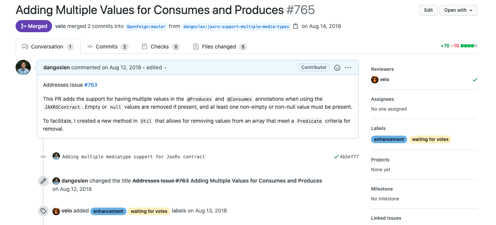

<i>
Photo by <a href="https://unsplash.com/@ecasap?utm_source=unsplash&amp;utm_medium=referral&amp;utm_content=creditCopyText">Elaine Casap</a> on <a href="https://unsplash.com/s/photos/share?utm_source=unsplash&amp;utm_medium=referral&amp;utm_content=creditCopyText">Unsplash</a></i>

If you are a beginner in the world of git and hosted git platforms (like GitHub or GitLab), you have probably heard the term "pull request" or "merge request" before. You also might not understand what they are or the value they bring to your team.

_Sidenote: I'll be using the term "pull request in this article, but it's effectively the same as a "merge request" in GitLab._

Pull requests help teams build and share software. They do have a bit of a learning curve though, but I believe its worth it. My goal in this article is to help you get familiar with pull requests and how they fit into the flow of building software.

## What is a Pull Request?
A pull request is really just a request to pull/integrate changes from one branch to another. It might be from a branch with a single commit from one developer, or a branch with multiple commits and author. In most cases, a pull request is used to integrate a new feature or bug fix into the project's main branch.

A pull request also includes a short description of the changes and why they are being made. There is usually a discussion amongst the author of the pull request and a set of reviewers. Reviewers are just other developers that have worked on the project and can provide feedback on the changes. In open-source projects, these reviewers will typically be core contributors or maintainers. In other cases, like your team at work, the reviewers will typically be senior engineers or teammates.

Here is an image of a pull request in GitHub with a simple description referencing an issue.

Now that we have defined a pull request, why are they so popular? How do they help?

## Communication
At their root, pull requests help by making it easy to collaborate with others. They allow for transparent communication between authors and reviewers by showing diffs, commits, and facilitating comments about the changes.

Before pull requests, changes were submitted via email or IRC channels with the branch name or a set of commits. For changes to be merged, a maintainer or release engineer would be responsible for comparing the changes on their local computer, offering feedback, and waiting for a response with additional changes. They would then have to merge the changes on their local machine and push them to origin.

Pull requests make this much simpler.

This is especially true for large projects with tons of contributors. Many open-source projects follow this pattern for that reason. Often, these projects follow a workflow called "GitHub flow." GitHub flow focuses on forking whole projects and creating pull requests across those forks.

If that sounds intimidating at first, don't worry! Just remember the core idea is the same: requesting changes from one branch to be incorporated into another. You can read more about forks and the GitHub Flow on the official git-scm site.

Another benefit of the pull request flow is that all communication about a set of changes is now open for all to see. They are searchable, taggable, and relatively easy to keep track of. This means context and previous decisions aren't buried in email threads or chat windows. Instead, they are easily searchable, taggable, and viewable to everyone.

## Automation
As pull requests became popular amongst the development community. GitHub and other git-hosting platforms created a rich set of [webhooks](https://docs.github.com/en/developers/webhooks-and-events/about-webhooks) designed around the GitHub flow to enable automation. It is common these days for continuous integration tasks to take place on every commit that is part of a pull request for this reason.

In my experience, this is one of the most leveraged places for automation. And not just running automated tests. You can deploy entire environments from the changes in the pull request and see if the deploy was successful.

It used to be that such tools or integrations were expensive. Either team's had to maintain infrastructure for their automation tasks, or they paid for hosted services. Recently, many more tools have become available to make it even easier to set up such tasks. Companies like Netlify and Travis have free offerings for many projects that you can take advantage of.

GitHub took this even further with the advent of [GitHub Actions](https://github.com/features/actions). Actions allow you to build your automation workflows from a marketplace of small, discrete, and composable tasks. You should really check them out!

## Status Checks
The last big benefit of pull requests is the concept of status checks. Status checks are just a set of tasks that are executed for every commit in the pull request and a "success" or "failure." In a very real sense, status checks become a checklist that the changes are good to go.

Status checks can be for whatever you want them to be. Most teams will have automated tests as one, style checkers as another, and then a requirement for one or two code review approvals. The changes can't be merged unless all these checks have been met.

The topic of code reviews is something worth mentioning in a little more detail. Because the ability to communicate and collaborate is so effective on a pull request, many teams use this as a natural place to review code. Pull requests can even manage reviewers, their reviews, and approval status right from the pull request page. Many large projects even have automation to add specific users or groups to a pull request based on the files that have changed. For example, take a look at the [CODEOWNERS](https://docs.github.com/en/github/creating-cloning-and-archiving-repositories/about-code-owners) documentation.

---

To summarize, a pull request is just a request to integrate changes from one branch to another. While so simple, pull requests are powerful. 

**They have become the epicenter of modern development.**

Pull requests facilitate continuous integration tasks, code reviews, and checklists to keep quality high. They have transformed a repository from being something that stores only source code to something that stores knowledge about that source.

This is also where most learning happens! Some of the most important lessons I've learned about software development have come from feedback from patient individuals on pull requests—lessons on coding, git, project management, and career growth too.

Happy coding!