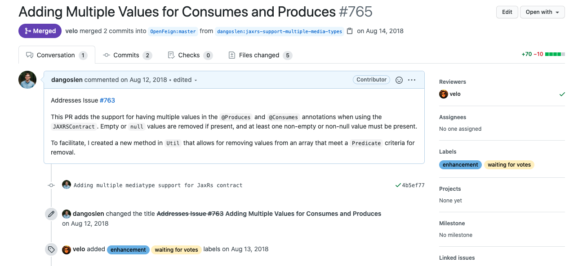

Photo by <a href="https://unsplash.com/@ecasap?utm_source=unsplash&amp;utm_medium=referral&amp;utm_content=creditCopyText">Elaine Casap</a> on <a href="https://unsplash.com/s/photos/share?utm_source=unsplash&amp;utm_medium=referral&amp;utm_content=creditCopyText">Unsplash</a>

If you've been coding for a while you've likely used some form of hosted git platforms such as GitHub, GitLab or BitBucket. You've also likely used a common feature of these platforms call "pull requests" (or "merge requests" depending on the platform). 

Pull requests are intended to help teams build and share software by managing the process of integrating changes from an author into a target branch. They help visualize the changes, provide space for comments and discussion, and are a natural place for automation tooling such as tests, linters, or other checks. 

This process, however, can often have a bit of a learning curve. My goal in this article is to help you get familiar with pull requests and how they fit into the flow of building software so that you can more effectively utilize them on your team.

## What is a Pull Request?

A pull request is really just a request to pull/integrate changes from one branch to another. It might be from a branch with a single commit from one developer, or a branch with multiple commits and author. In most cases, a pull request is used to integrate a new feature or bug fix into the project's main branch.

A pull request also includes a short description of the changes and why they are being made. There is usually a discussion amongst the author of the pull request and a set of reviewers. Reviewers are just other developers that have worked on the project and can provide feedback on the changes. 

In open-source projects, these reviewers will typically be core contributors or maintainers. In other cases, like your team at work, the reviewers will your teammates or they may some form of expert identified through [codeowners files](https://docs.github.com/en/repositories/managing-your-repositorys-settings-and-features/customizing-your-repository/about-code-owners) or other means.

Here is an image of a pull request in GitHub with a simple description referencing an issue.

Now that we have defined a pull request, why are they so popular? How do they help?

## Communication

At their root, pull requests help by creating a shared space for collaboration. They allow for seamless communication between authors and reviewers by showing diffs, commits, and facilitating discussion about the changes.

Before pull requests, changes were often submitted via email or IRC channels with the branch name or a set of commits. For changes to be merged, a maintainer or release engineer would be responsible for comparing the changes on their local computer, offering feedback, and waiting for a response with additional changes. They would then have to merge the changes on their local machine and push them to origin.

Pull requests make this process simpler by visualizing in one place the changes, the discussion, and any checks required for the changes to be accepted.

This is especially true for large projects with many contributors. Open-source projects often follow this pattern for that reason, often using a specific form of git management called [GitHub flow](https://docs.github.com/en/get-started/using-github/github-flow). GitHub flow focuses on forking whole projects and creating pull requests across those forks (remember, git is a distributed source control system and a branch on a particular origin can still be compared to a branch on a different origin).

If that sounds intimidating at first, don't worry! Just remember the core idea is the same: requesting changes from one branch to be incorporated into another. You can read more about forks and the GitHub Flow on the official [git-scm site](https://git-scm.com/book/en/v2/GitHub-Contributing-to-a-Project).

The biggest benefit of the pull request model is that all communication about a set of changes is now open for all to see. They are searchable, taggable, and relatively easy to keep track of. This means context and previous decisions aren't buried in email threads or chat windows. They are persisted records that we can go back and refer to or even dig through like an archeologist to learn about the code base. 

## Automation

As pull requests became popular amongst the development community, GitHub and other git-hosting platforms created a rich set of integrations around the process. These integration points are usually some form of [webhook](https://docs.github.com/en/developers/webhooks-and-events/about-webhooks) designed to trigger other software components to react to an even in the pull request lifecycle. It is common these days for continuous integration tasks to take place on every commit that is part of a pull request for this reason.

In my experience, this is one of the most leveraged places for automation. And not just running automated tests. You can deploy entire environments from the changes in the pull request and see if the deploy was successful.

It used to be that such tools or integrations were expensive. Either team's had to maintain infrastructure for their automation tasks, or they paid for hosted services. Recently, many more tools have become available to make it even easier to set up such tasks. Companies like Netlify and Travis have free offerings for many projects that you can take advantage of.

GitHub took this even further with the advent of [GitHub Actions](https://github.com/features/actions). Actions allow you to build your automation workflows from a marketplace of small, discrete, and composable tasks. You should really check them out!

## Status Checks

The last big benefit of pull requests is the concept of status checks. Status checks are just a set of tasks (often triggered via the webhooks mentioned above) that report "success" or "failure." In a very real sense, status checks become a checklist that the changes are good to go.

Status checks can be for whatever you want them to be. Most teams will have automated tests as one, style checkers as another, and then a requirement for one or two code review approvals. The changes can't be merged unless all these checks have been met.

The topic of code approvals and code reviews is something worth mentioning in a little more detail. Because the ability to communicate and collaborate is so effective on a pull request, many teams use this as a natural place to review code. Pull requests can even manage reviewers, their reviews, and approval status right from the pull request page. Many large projects even have automation to add specific users or groups to a pull request based on the files that have changed (the codeowners mentioned before).

Code reviews is a whole topic to itself, so for now I'll just point you to many of my [other resources on the topic](https://dangoslen.me/tags/code-reviews)!

---

To summarize, a pull request is just a request to integrate changes from one branch to another. But in reality, they are much more than that:

**They have become the epicenter of modern development.**

Pull requests facilitate continuous integration tasks, code reviews, and checklists to keep quality high. They have transformed a repository from being something that stores only source code to something that stores knowledge about that source.

This is also where most learning happens! Some of the most important lessons I've learned about software development have come from feedback from patient individuals on pull requests—lessons on coding, git, project management, and career growth too. 

Learn to leverage pull requests effectively and they will pay you back in helping create a safe and fast flow of work for your team.

Happy coding!