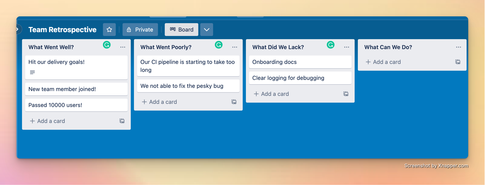

<i> 

Photo by <a href="https://unsplash.com/@josemreyes?utm_source=unsplash&utm_medium=referral&utm_content=creditCopyText">José M. Reyes</a> on <a href="https://unsplash.com/photos/0GBxtiFvzXE?utm_source=unsplash&utm_medium=referral&utm_content=creditCopyText">Unsplash</a>

</i>

A foundational component of Agile (whatever flavor of it you like) is [daily improvement](https://dangoslen.me/blog/how-to-introduce-kaizen-to-your-team/). Teams need to improve their code, tools, and even process to improve over time.

But when exactly does a team talk about _how_ they should be improving? Enter the retrospective.

Retrospectives are some of the most neglected meetings in the software industry. I remember bringing a retrospective meeting to my team many years ago. Participation in was far from enthusiastic. They didn't see the value of reflecting on the past iteration and didn't care much about improving anything other than the code. Some were also put off by any mention of Scrum, with one engineer declaring, "We don't follow Scrum!" in a rather aggressive tone.

And while that engineer was correct - retros originate from the Scrum guide - teams working in _any_ iterative development cycle can still benefit from having a regular retrospective. 

But it takes some effort and some experimenting. Today I want to walk you through what a retro is, a few high-level formats on a excellent retro, and my top tip for making your retros effective.

## What is a Retro?

A retro is time for the team to gather, reflect on their work over the past iteration, and discuss ways to improve. The Scrum guide puts it this way:

> The purpose of the Sprint Retrospective is to plan ways to increase quality and effectiveness. [...] The Scrum Team identifies the most helpful changes to improve its effectiveness. The most impactful improvements are addressed as soon as possible.

But before getting hung too much on Scrum and Sprints, pay attention to the core idea of the retro. The team asks, "How can we plan to increase our quality? How can we build a more effective process? How can we get better?" Regardless of how your team delivers work, this is a valuable exercise.

To help break out of "sprint" thinking, think more about an iteration. How does your team break up work so that you can develop iteratively? However you divide up work (a time interval, release cadences, actual Sprints), the end of that iteration is a good time for a retro.

For example, the team I brought retros to that I mentioned earlier had a monthly release cycle. It made sense for us to use that same cadence for our retros too. We would wait until after the release had gone out and then reflect on how that release had gone.

The only caution is if your iteration is a time interval and that interval is long. Anything longer than a quarter is too long. You will only be able to course correct if you get feedback fast enough. [One degree off](https://en.wikipedia.org/wiki/1_in_60_rule) can take you far from your planned destination. Don't wait too long.

One caveat around time intervals: I've found that retros for short time windows (a week) often repeat themselves as the team hasn't had enough time to take action from the previous retro or actions they have taken haven't had enough time to make a meaningful difference. These effects are especially true for process-oriented changes. Declaring, "Let's tag work items this way from now on," and then revisiting that the next week will likely have a minimal sample size to determine if it is working. Give your team time to make progress.

## How To Run One?

Now that we've defined the goals of a retro, how does one go about running one?

Like running any good meeting, running retros is just as much about the prep work ahead of time as the actual meeting. If you've heard the phrase, "A meeting worth having is a meeting worth having an agenda," retros follow the same ideas.

Here are a few tips to prepare for the retro.

### Pick a Format

Retros come in many shapes and sizes. The differences are often in the questions they ask the team to answer. Some retros focus on tracking employee engagement through sentiment or energy questions while others might focus on tactical questions ("Did we hit our goals? Why not?").

One format I've always turned to time and time again is 4 "what" questions.

* What went well?

  Is the team hitting its delivery goals? Are they collaborating effectively? Are they hitting their SLOs?

* What went poorly?

  Is there a bug plaguing the team? Is there a bottleneck in their process? Was there something particularly confusing or frustrating that held up development?

* What did we lack?

  Is there a tool that could have helped the team do better? Are they knowledge gaps they need to close? 

* What can we do?

  This is where you will list your team's action items at the end of the meeting. Tell your team to wait to fill this out during the meeting. But by having it as a section before the meeting will start getting people thinking about possible actions and solutions earlier, leading to a more productive session. 

Once you decide on a format, create a document in whatever online collaboration tool your team uses (Google Docs, Trello, Lucidchart, etc.). Group the document into sections under the questions you choose to use. A simple version of this in Trello might look like this:

A day or so before the retro, send the document out, asking the team to provide their answers before the meeting. You'll be surprised how doing this little bit of async work will lead to better discussion and time allocation in the meeting. 

### Divide the Time

Speaking of time, a critical component of running a good retro is using time wisely. Your retro needs a structure to help keep the meeting flowing without going over.

A good method for this is running the retro in a [Lean Coffee]() format. In this format, everyone brings their ideas to the meeting and follows a lightweight process to determine what the group should discuss. The idea is that a Lean Coffee meeting has a structure but not a set agenda. It focuses on the allocation of time and the activity during that time of time rather than the actual content.

Here is a brief guide on how to run a retro like a Lean Coffee meeting:

* Give time for members to add their answers to the questions

  Start out the meeting with 5-10 minutes of quiet time for the team to add any remaining answers to the questions. If you use a tool that has a timer component built-in, definitely use it. It can be easy to 

* Vote for the top items

  Once all answers or items are in, conduct a quick "voting round." Give the team 2-5 minutes (depending on team size and the number of items) to scan over the items from each other and vote on what they would like to discuss. If you use a tool that has voting built-in great! Use it. If not, adding comments or even "[+1]" at the end of a Google Doc can work well too. 

  Don't give infinite votes, either. 3-4 votes per team member is good for a 4-5 person team. Any more and too many items have the chance of being upvoted, leading to too many options to discuss. Any fewer items and only some items will get more than one vote.

* Discuss the top items

  For the top 2-3 items in each group, spend about 5 minutes in discussion. Ask the team member who added the item answer to expand upon what they wrote. See if the rest of the team agrees or disagrees. 
  
  Take summary notes of the discussion as a comment under the item. Be brief here; a high-level understanding of extra context is all you are after. 
  
  If the team begins to talk about actions to take, write them down in the discussion notes too. Be careful to keep the entire discussion from focusing on solutions. Those conversations can take up the rest of the discussion time, and you'll plan time to talk about solutions later anyway.

  Like everything else, keep a timer and keep things moving. As you move through the retro, you'll find that many items are intertwined: a positive of getting a feature out might also have a negative impact that the team felt overwhelmed. Getting a survey of the top "themes" across the items is the best prompt for your action items.  

* Identify and assign action items

  Once you have discussed all the themes, it is time to turn from examining the past iteration towards actions to take in the upcoming iteration. Action items don't need to be grand or all-encompassing. Heck, a good action item from a retro might be "Let's see what happens without pointing stories this sprint" or "Let's try being more intentional about discussion acceptance criteria in our stories." 
  
  The key is to put down action items that are actionable. It can be easy to put an action that is so vague and verbose that the team can't make any progress on it. Assing an owner to actions where you can. This isn't always possible (like in a few examples above), but if the action concerns getting access to a tool or starting a conversation, having an owner will go a long way.

### A Few Notes On Facilitation

As the facilitator of the meeting, you play a very important role. Not just about keeping the meeting on time but about setting the tone.

For a retrospective to be insightful, there needs to be [psychological safety](https://rework.withgoogle.com/guides/understanding-team-effectiveness/steps/foster-psychological-safety/). The team must feel safe to share their opinions about what went well, what went poorly, and where the team is lacking. If they don't feel safe, they will withhold their opinions and perspectives, stunting the effectiveness of a retro altogether.

Part of your job is making sure that safety is upheld (at least within the meeting). If there is a disagreement, try to affirm everyone's perspectives and keep the conversation from escalating. If people share an opinion that was difficult to share or was vulnerable in any way, thank them for sharing their perspectives. If people begin blaming or making assumptions about others, do your best to bring it back to facts.

It may take time for everyone to feel safe in this meeting, so don't try to rush it. Take it one step at a time.

## My Top Takeaway

Of all the retros I've been a part of there is one top takeaway that separates the good ones from the bad ones: they focus on just *one* key thing to improve on from retro to retro, committing to make changes by the next meeting.

One action likely doesn't sound like much. And you could be right. What I've found, though, is that by focusing on one action item, the team actually makes progress and sees the value of the retro more meaningful. Too many action items can often be a distraction, especially when there are competing priorities for development (which is always the case). 

Focus the team on making an impact through one action item, commit to it, and make sure to discuss it at the next retro.
