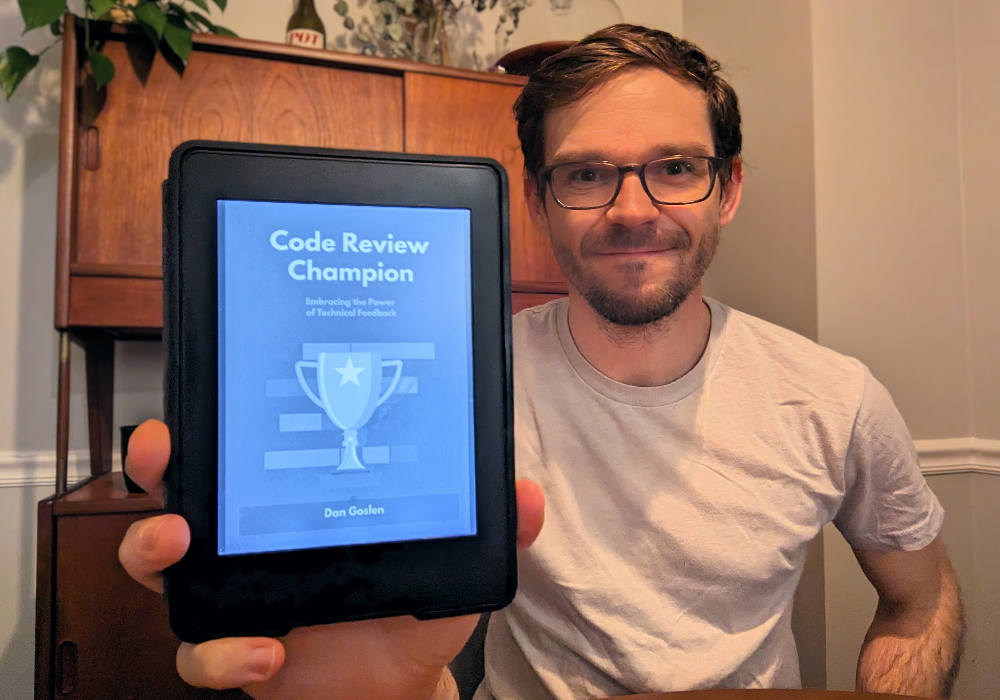

<i>Look ma! I wrote a book!</i>

Today, I'm launching _[Code Review Champion!](https://dangoslen.me/book)_ I've been working on this book over the past three years and am so excited to get it into the hands of readers!

Throughout the process, I've consistently been asked one common question about it:

> "Why are you writing a book?"

Today, I'm answering this question to help you understand my motivations and goals for the book better.

## Why I Wrote Code Review Champion

It's hard to pinpoint exactly when I started thinking about writing a book. I don't remember ever having a "eureka!" moment or being suddenly inspired by a book title or anything like that. Instead, it was a much more gradual process that followed my career learnings in almost perfect lockstep.

In late 2017, I was having a tough time in my career. I was working on a somewhat chaotic project at the time. Things were confusing and disorganized. It was hard to know what we were building and who was leading the project. Depending on who you talked to, you would get different requirements, timelines, etc.

During this time, I was trying really hard (read: much too hard) to level up my personal coding skills. I wanted to learn how to write better software and was trying to hold myself to a high standard. 

Unfortunately, one of the side effects of this was I became way too harsh and pedantic in code reviews. I commented on the silliest details, was unwilling to compromise, and, frankly, was a bit of a jerk. At the time, I thought I was helping our team maintain a high level of code quality. Now I know that I was doing the exact opposite.

It took me a while, but I eventually realized that my actions were hindering my team. "Holding the line" on one's opinions about technical correctness or ideal solutions wasn't working. I needed to find a different way.

I started reading various blogs from Google, GitHub, and Thoughtbot on code review practices. While I found them all helpful, at the time, they were very focused on tactics: what to look for, the best ways to leave a comment, how to provide evidence, etc. 

But I kept wondering: what is the _strategy_ for code reviews? Is there a singular goal or principle encompassing all the other goals and benefits we look for in a team's code review practice?

This question eventually led me to believe that code reviews are primarily about one thing: knowledge sharing. It was even the topic of the first article on this blog—[What's the Point of Code Reviews Anyway?](https://dangoslen.me/blog/whats-the-point-to-code-reviews-anyway/).

Upon writing that post, I discovered I really enjoyed writing about software. As I kept learning in my career, I kept writing, trying to share my learning and experiences with others. And because I had spent so much time learning and reading about code reviews, leading to several other posts about code reviews (as you can see by searching for the ["code review" tag](https://dangoslen.me/tags/code-reviews)).

## From Blog to Book 

From the fall of 2018 to the end of 2020, I was working towards my master's degree part-time. At the end of 2020, my wife and I took a short snowboarding trip to Colorado to celebrate my graduation, relax, and unwind (2020 was a stressful year...). 

I had saved up more vacation time than her, so she decided to spend a few days working remotely before the actual snowboarding took place. We needed a few days to adjust to the altitude anyway, so it made sense to go a week or so before we hit the slopes. I decided I'd fill the time writing for my blog and website during those first few days. 

As I was writing, I realized I wanted to write something longer than a one-thousand-word article. I had all these ideas about code reviews, and I wanted to get them out into the world, but a series of posts wouldn't be the right medium for it. I had already written several posts then and was sure more articles weren't the way to go.

I also had a sudden set of extra time on my hands. After finishing a master's degree, what would I spend my spare time doing? It was still COVID time, and some of my other interests (ultimate, climbing, etc.) were still restricted on a daily basis. Climbing or playing ultimate in a mask was not something that sounded doable (I did try both, and neither was very fun...).

So I started... writing a book. 😅

Over the coming months, I began clarifying my motivations more and more. Writing a book is not for the faint of heart (as I'll dive into next). I knew I needed more than "it's fun" as a motivator. 

What I landed on was that I wanted to write a book for two reasons:

1) To grow as a writer. While I was writing regularly on the blog, I still wanted to improve my writing. A book would stretch my existing skills and force me to gain new ones.

2) To help others. I wanted other engineers to learn from my mistakes around code reviews. I also saw a significant gap in both boot camps and college programs around code reviews. No one taught code reviews in their curriculum despite reviews being a common part of an engineer's responsibilities at many major companies.

There were other motivations in there, but these were the primary ones. 

## Book Goals

As I kept writing the book, these motivations began to coalesce into a singular goal for the book: I wanted to write a book that would give searching engineers a new set of tools around code reviews in a weekend.

Let's say there was an engineer, Tom. Perhaps Tom had a week where code reviews were particularly frustrating him. If he searched for a book on code reviews, Code Review Champion might pop up. If he decided to buy, my hope would be that Tom could read the book over two or three days and have new skills (and a reference) when he returned to work on Monday.

This idea really helped me as I wrote and edited. It kept me from rambling (which I tend to do) and even led me to cut two or three chapters. This goal also helped me realize I didn't need to convince my readers of the _value_ of code reviews; my core reader was someone who wanted to _improve_ their (or their team's) code review skills quickly. Finding that audience persona also helped keep the book focused.

This goal also forced me to keep things succinct and action-packed. I don't attempt to re-share every helpful blog article or idea I've ever learned concerning technical feedback or code reviews. Instead, I focus primarily on the key principle I've discovered through my career and research:  code reviews (and all technical feedback) are all about knowledge sharing.

The success of this book, then, won't be about sales or volume. I'm not aiming to become a full-time content creator or influencer or any of that. 

Instead, I'm much more interested in making sure that it was _helpful_ to those who purchased it. 

I'm trying to live out what I talk about as the core tenant of code reviews—I'm trying to share what I've learned along my journey. 

Happy reading!

_If all of this sounds like a book you might enjoy, go [buy your copy of Code Review Champion](https://dangoslen.me/book) today!_

