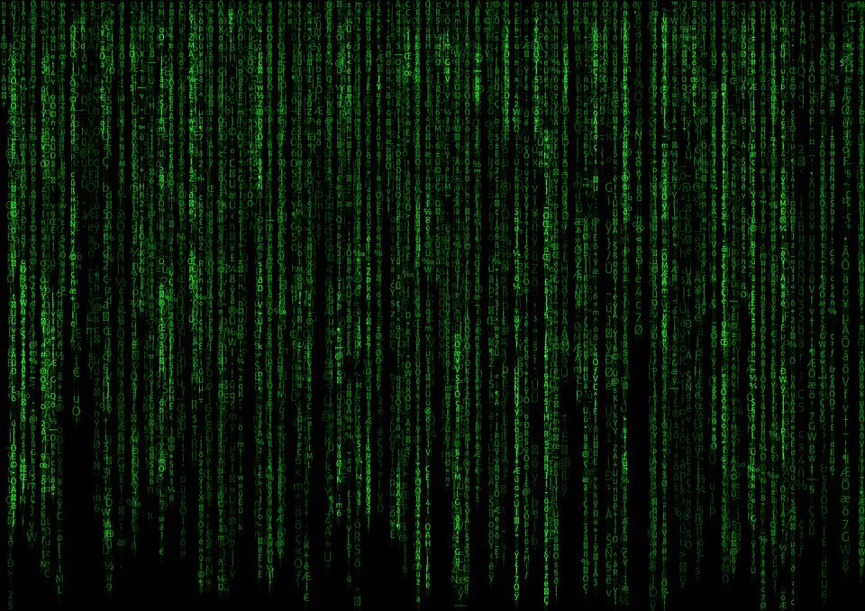

[Don’t Repeat Yourself](https://en.wikipedia.org/wiki/Don%27t_repeat_yourself) (DRY). It’s basically a law of programming, especially [object oriented programming](https://en.wikipedia.org/wiki/Object-oriented_programming). The whole idea is that you should aim for reusability of objects, functions, etc. where possible and if you find yourself copying code from place to place, you have gotten something wrong.

**It’s a great heuristic, for your code, but it can also lead to some really ugly stuff.** Places where a poorly named variable gets reused in situations it wasn’t meant to. Times when you find yourself three or four layers of inheritance deep and not understanding what anything means… or changing a variable to make one test or code easier, but then breaking code everywhere else because it was being reused.

In general, I think developers, especially young developers, spend too much time trying to think about the future and how their code will evolve rather than writing simple and maintainable code.

Simple code is **always** better than complicated code!

Trust the rules of [Keep it Simple Stupid](https://en.wikipedia.org/wiki/KISS_principle) (KISS). The whole point of KISS is focused on the operators and future maintenance of something — even if that means trading off a little efficiency to do so. The entire idea originated from the designers of some of the most advanced airplanes at the time (including the SR-71 and U-2 planes). Their desire was that even this complex planes would be fixable and maintainable at any military base or hangar with reasonable tools.

Think about the implications of that. If we wrote code in such a way that ANY developer could read, understand, and feel confident about making changes, how powerful would that be?!

Below are some ways you can work towards keeping code simple first.

## Repeat Yourself

At least at the beginning. Don’t worry about how “future thing A and future feature B” will need to re-use your code. You can’t predict the future — why try to do it with your code?

If you repeat yourself a few times (like having a really similar comparator or predicate in several places), evaluate if your code would be made simpler or more complicated by trying to make them reusable. If what you have is really easy to read, understand, and change, leave it that way for a while. **Instead of making something simple complicated for the sake of reusability, keep it simple for the sake of sanity.**

As your code grows, so will your understanding of your problem space. You will learn the code that needs to be really fast and that needs to be consistent. You will learn were the places for good abstractions are, and the places you didn’t need them in the first place.

As you figure that out, you can then refactor and consolidate code that needs to be reused. Sure you will have to work in the refactor, but I would bet that your abstraction and refactoring will be better **after** you’ve explored how that code is being used than predicting how you think it will be.

## Embrace Code Reviews

How do you know you have simple code? Ask a teammate!

Of all the people who need to understand your code, it’s your teammates. They will be responsible for fixing it in a few weeks or modifying it for a future feature. If they can’t read it and understand it, you need to re-think it.

Ask your teammates for feedback in code reviews or pair programming sessions. Don’t be afraid to point out places you wrote the same code a few places and ask for help on how to consolidate if needed. Ask the senior developer on your team what they would do.

**Remember that code isn’t telling a computer what to do: it's telling another developer what it’s instructing the computer to do.**

## Read Simple Code

To know what simple code reads like and feels like (yes, feels like), you need to go read a lot of really simple code. Read code should be as easy as reading a book (unless you are bad at reading books like me).

Even the most complex of algorithms can be written in simple ways. Go pick up copies of textbooks that have artificial intelligence algorithms or go read some of the code from your favorite open-source project. What you will find is extremely simple to read code doing extremely complex things.

This is why software development is just as much of an art as it is a science. **We are writers**! We are telling a story! No good writer wrote a bestseller by just writing over and over the same thing. They read great literature over and over and over. They have come to learn from all that reading what a good story feels like. The same is true with code.

- - -

If you still aren’t convinced, just Google [perils of complicated code](https://lmgtfy.com/?qtype=search&q=the+perils+of+complicated+code). [Kent C Dodds](https://kentcdodds.com/talks/) has a talk coming up about this and is proposing a new acronym: *Avoid Hasty Abstractions* (AHA). I’m excited to listen to it!

Happy coding!