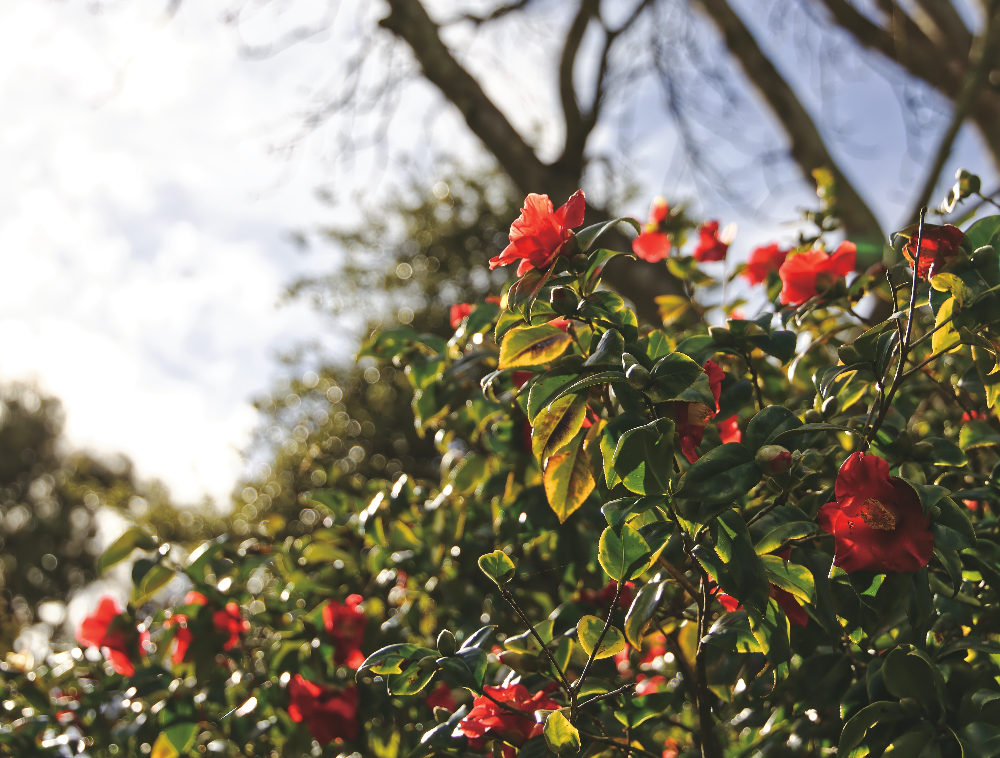

<i>

Photo by [gryffyn m](https://unsplash.com/@botanicalnature?utm_source=unsplash&utm_medium=referral&utm_content=creditCopyText)> on [Unsplash](https://unsplash.com/s/photos/garden-lush?utm_source=unsplash&utm_medium=referral&utm_content=creditCopyText)
  
</i>

There are many - _many_ - analogies to writing software. 

Building a building. Creating a city. Trying to change the tires of a car while driving.

None are perfect, but they each help to convey an idea about the complex work that is writing software. There are many factors to consider, an ever-changing set of requirements and needs to be met. Plus, once you build software, you usually don't demo it and start over - even though sometimes that is the **only** thing you can do.

I'd like to add another anology: growing a garden. 

## Gardening Newb

Full disclosure, I'm new to gardening. I don't have rows and rows of flowers of every color. I don't have planter boxes with fresh veggies surrouding my house. I'm still learning how to properly keep grass in my lawn and get the weeds out of where I want to have a garden. 

But I'm learning so much. And ever time I am learning something new, I try to connect it to things I know already.

And as I was out weeding (and weeding, and weeding...) a thought struck me: I need to be weeding my code. Let me share some quick context first.

## Bugs, Weeds, and Technical Debt

Let me share some quick context first. We talk alot about bugs and technical debt in software. Bugs are anything with our code that is actively causing problems. No one would argue that we shouldn't address bugs and that we should catch them as early as possible in the development process.

Technical debt, however, is different.  Many devs can't even agree on what we mean by technical debt. Some think technical debt is an intentional decision that operates as traditional, well, debt: the team chooses to take on _debt_ that will be repaid later in order to finish something (usually a feature) sooner. A team might decide to ignore upgrading dependencies until a feature is complete for example. Or they might decide to ignore an edge case that complicates code and tackle it later. In either case, technical debt here is a decision to get something done faster at the expense of doing it later when it might be more difficult to do.

Other teams use technical debt as "anything we need to fix that isn't a bug yet". Some teams might expand it to "whatever we want to work on that isn't product work." I've never liked these definitions of technical debt myself; but I've wrestled with what else to call it. What do you call something that grows on it's own, can take over a space, and eventually can strangle what ever is around it?

Weeds. 

I made that connection after a few days of weeding like I was sharing above. "I need to be weeding my code" I thought. And so I started thinking of writing software as growing a garden.

## Software is a Garden

If software is a garden, then let's say that our features are the plants in our garden. Whether fresh veggies, flowers, or trees we want them to grow strong and be the focal point of our garden. From time to time we might prune them to help them grow or we might remove them entirely because we have other plants we have decided would work better. This is akin to how we might manage features we build in our software. 

But what kills those plants? Typically bugs, weeds, some animals, and general lack of care. Bugs and animals tend to eat the plants outright, or spread disease to plants that kill them slowly. Lack of watering or fertilizer won't provide the nutrients plants need to grow properly. And weeds can strangle the life of plants and rob the plants of nutrients or water from the soil.

Our software has all of the same problems. We have bugs that kill our features and keep our customers away. We might have security vulnerabilities that we missed and have no fence to protect against an attacker totally taking over our system. We might forget to apply regular maintenance and monitoring to one day wake up to a failing system. Seemingly harmless hacks or duplicated code eventually grow to strangle our ability to create new features. Or worse, grow so big that we are afraid if we change it, we will inadverntly damage our features in the process.

## Software Engineers are Gardners

If software is a gardne, then software engineers are gardners. A gardner, is tasked with making sure the garden grows as they want. It is the gardner's responsibility to implement preventitive measures to keep bugs away by spraying a pesticide. Fences might be installed to keep animals out. A gardner might create a daily schedule to make sure they water each plant, to prune each plant, or to till the soil with fertilizer. To deal with weeds, a gardner needs to go out and pull them up by the roots; simple cutting won't work. 

In our software, we need to have tests to make sure bugs aren't creeping into our software. We need to run regular security audits and update our dependencies to mitigate security risks. We need to make sure we monitor our software and make maintenance of our systems easy so that we aren't caught off gaurd by a system failure. We need to be rigourous to eliminate the weeds in our code that will eventually stifle our efforts to write new features, fix problems, and maintain our code over time.

Photo by [Ivan Aleksic](https://unsplash.com/@ivalex?utm_source=unsplash&utm_medium=referral&utm_content=creditCopyText) on [Unsplash](https://unsplash.com/s/photos/weeds?utm_source=unsplash&utm_medium=referral&utm_content=creditCopyText)
  

</i>

## Debt vs Weeds

I like to think of code weeds as different than technical debt. Like I mentioned earlier, technical debt is a decision made to finish a feature sooner, knowing full well that something will need to be repaid later. A weed is something that is inevitable. Weeds simply appear and grow without warning. No one plants a weed. No one wants them to grow. But they are unavoidable.

Every programmer with more than a few years of experience can identify with the following story. One day while coding, they come across a function or class that doesn't make sense. Perplexed, they think "who wrote that and why did they write it that way?" They open `git blame` and realize ... they were they author. 

I share that because most code will grow weeds. The best code I've ever written needed to be refactored later on. It isn't because the code was bad (that is another problem), but because most code over time needs to adapt to the changing requirements and responsbilities of the system it powers. 

This is different than technical debt. This is part of writing good software. You have to pull up the weeds.

---

I hope this analogy helps you in your journey of writing great code and great systems. It takes dilligence and willingness to roll up your sleves, put on some gloves, and start pulling up the weeds in your code. But having a healthy garden where your features thrive is worth it.

Happy coding!

