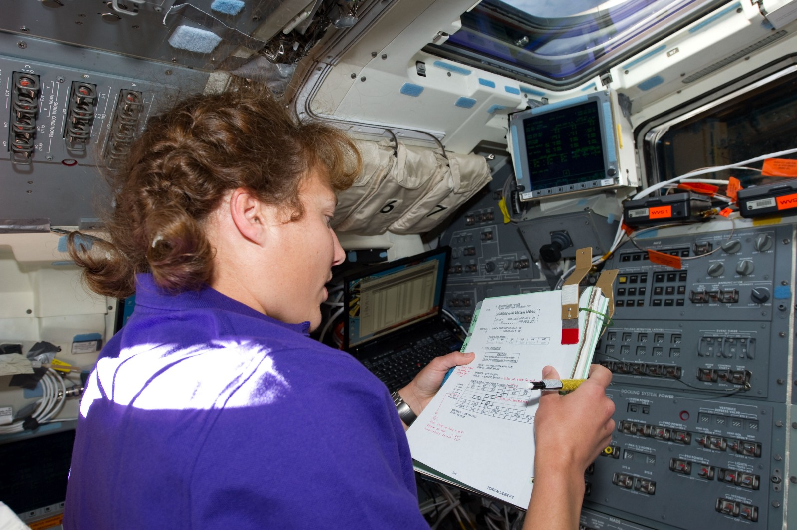

Code reviews are a place of contention for a lot of teams. Even when teams know code reviews are worth the effort, they still struggle to make them effective. Code reviews usually become a place for everyone’s subjective opinion to come out which leads to arguments, hurt feelings, and distrust within a team.

Once distrust starts on your team, it's hard to recover. Animosity will grow. Lack of confidence declines. Motivation declines. Code quality will suffer. For these reasons, having an as close to an objective process in your code reviews is vital to your team’s success.

So how do get to performing objective-based code reviews? 

I suggest you use a checklist.

## Checklists Work
One of the ways you can help keep code reviews from becoming such a place of tension is to create and maintain a checklist. We all know what a checklist is. NASA took checklists to another level with their process for defining a checklist for literally every process involved in spaceflight. Launch, landing, spacewalks, etc.

Why? Because they know that thinking through the places of tension and decision before the actual moments of decision removes subjectivity as much as possible.

The entire purpose of go/no-go decision-making allows for all parties involved to have their opinions heard without the stress of a decision looming. Just think about it. If you were the head of mission control and you have astronauts on the launch pad who have been training and waiting literally years to go to space and the weather is just a tad finicky, you have a lot of stress at that moment. If you haven’t defined what the thresholds for acceptable weather conditions are, making that decision is nearly impossible.

Gene Krantz writes about some of these stresses in _[Failure Is Not an Option](https://www.goodreads.com/en/book/show/141499)_, his memoir of helping to build Mission Control from the ground-up. In the book, Gene discusses the tragedies and victories he experienced in his career at NASA. Each experience was a lesson in how to improve and prepare even better. The way they helped to capture those lessons were in the form of tweaking their checklists for each process. With these checklists in place, making go/no-go decisions became not only easier, but they had confidence they were making the right call.

## Code Reviews Are Important Too
Let's be clear right up front: a code review isn’t nearly as stressful as a go/no-go decision for launching a human being into space.

However, code reviews are important. Software is becoming pervasive in every arena. Medicine, finance, driving… spaceflight. Your industry might not need to have the same rigor for your software as some of the industries listed above, but make no mistake: the code you write affects people! If affects the world.

As software engineers, we need to own up to our responsibilities as software engineers sooner rather than later. We can’t afford to become lazy devs who don’t really care and rubber-stamp code when we see it. We can’t afford to approve code without tests to verify the changes. We can’t afford to ignore clear signs of bad code when under a deadline.

You need a checklist.

## How to Start?
You might be wondering how you get started though. “That all sounds great, but how do I figure out what is on the list and what is not?”

My recommendation is this: you go ahead and write up a starter checklist. The things you would require to be present in any code you reviewed. Personally reference this list of yours as you review and pay close attention to the code you review. Add to your list. Remove things from it. Refine it over time.

Once you’ve used this personal checklist a few times, open it up to your team. Don’t force it down anyone’s throat or mandate it. Simply share it as a resource you have used to help. Your teammates will then help you refine it and add their own thoughts/opinions. They will disagree with you on a few things, but if you have taken thought and care into it, chances are they will appreciate it and use it.

Once you have everyone using it, then you mandate it. Make it a Google Doc that you get in front of every developer on every code review (thing GitHub Pull Request Templates). Make sure it's linked to your team’s onboarding guides. Half the battle is making sure everyone knows the checklist 1) exists and 2) where to find it.

## Example List
The hardest part is usually either starting or finishing something. I can’t necessarily help you with finishing, but hopefully, I can help with starting.

Our code review checklist is pretty short. Some applications have additional items for application-specific concerns that often get missed, such as replication considerations. I can’t share the exact document we use, but it looks something like this:

* Do these changes meet the business requirements of the story?
* Do these changes meet the coding quality of our team?
* Do these changes have associated tests?
* Do these changes have screenshots or demos for user interface changes?
* Has the changelog been updated for these changes?
* Has the application documentation been updated for these changes?

The list doesn’t focus on nitty-gritty details like “are my variables named correctly” as that is really captured in the second item. It also focuses on the core aspects of a code review, [which is understanding](https://dangoslen.me/blog/whats-the-point-to-code-reviews-anyway/).

---

These lists can be as long as short as you need them. My recommendation is that shorter is better — no one wants to become a code review monkey checking boxes in the same way no one wants to become a code monkey. Keep your list focused on helping authors and reviewers think through things often forgotten and it will be a great help to your team.

Happy coding!